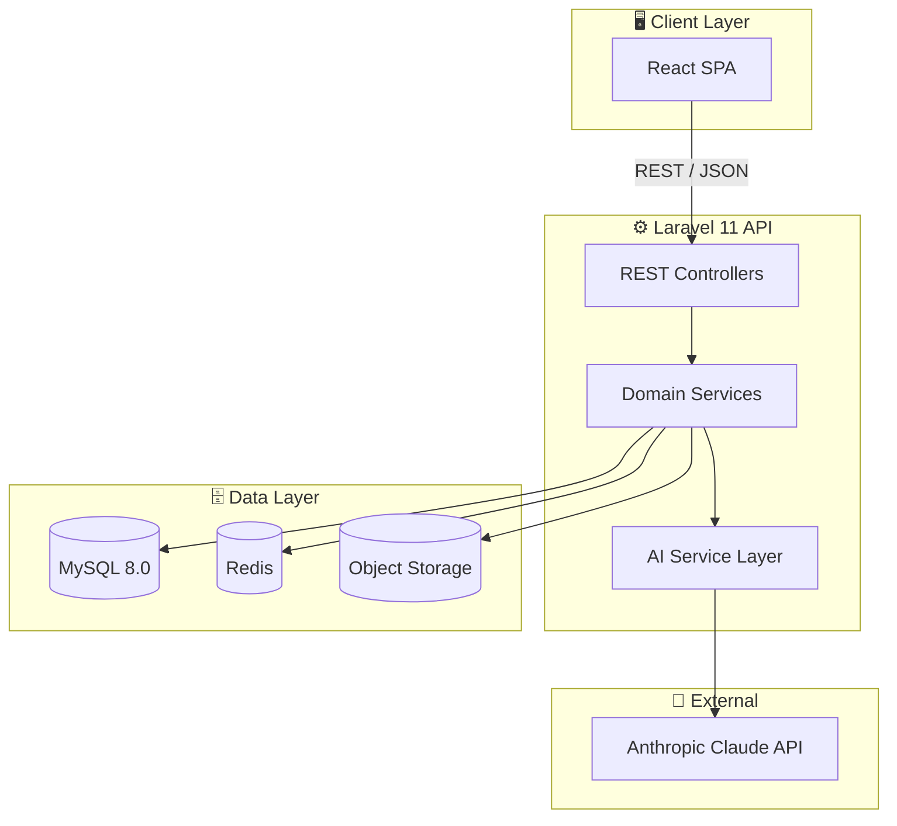
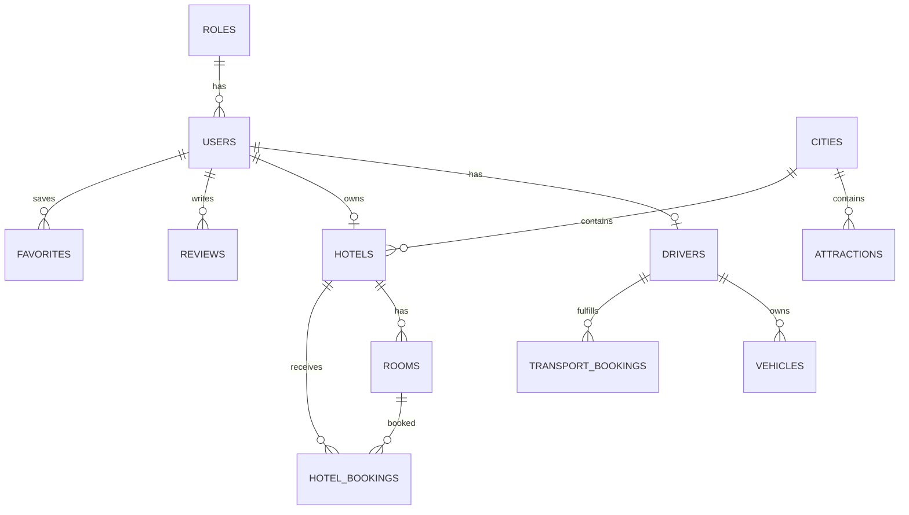
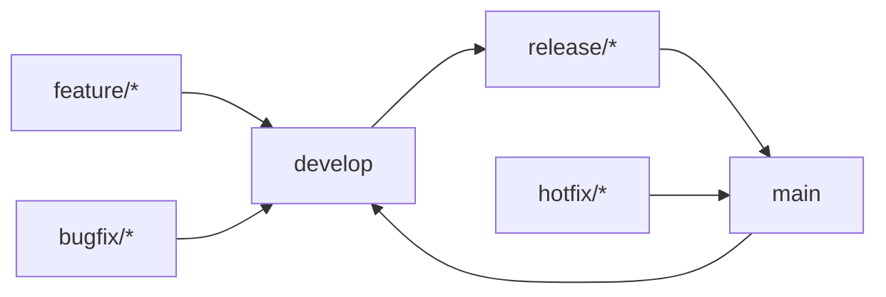

# 🇲🇦 Smart Tourist Guide Morocco

### AI-Powered Tourism Platform — Discover, Book, and Explore Morocco

[](https://laravel.com)
[](https://react.dev)
[](https://www.typescriptlang.org)
[](https://www.mysql.com)
[](#-license)
[](#-roadmap)

</div>

---

## 📖 Project Description

**Smart Tourist Guide Morocco** is a full-stack tourism platform that helps travelers discover Moroccan cities, attractions, and hotels, book accommodations and private transport, and get **AI-generated personalized itineraries**. Hotel owners and drivers get dedicated dashboards to manage listings, vehicles, and bookings, while admins moderate the entire catalog.

The platform is built as a decoupled **Laravel 11 REST API** + **React 18 / TypeScript SPA**, with an integrated **AI layer powered by the Anthropic Claude API** for itinerary generation, smart recommendations, and a multilingual travel assistant.

---

## ✨ Features

| Category | Features |
|---|---|
| 🔐 **Auth & Roles** | Register/login, role-based access (Admin, Tourist, Hotel Owner, Driver), profile management |
| 🏙️ **Discovery** | Browse cities, search/filter attractions and hotels, geolocation-based results |
| 🏨 **Hotel Booking** | Room browsing, availability checks, checkout flow, booking status tracking |
| 🚗 **Transport Booking** | Driver/vehicle browsing, fare estimation by distance, trip status tracking |
| ⭐ **Reviews & Ratings** | Post-completion reviews for hotels, attractions, and drivers, with cached average ratings |
| ❤️ **Favorites** | Save attractions and hotels to a personal wishlist |
| 🤖 **AI Itinerary Generator** | Multi-day personalized itineraries based on interests and budget |
| 🌍 **Multilingual** | English / French / Arabic content support |
| 📊 **Dashboards** | Dedicated dashboards for Hotel Owners, Drivers, and Admins |

---

## 🛠️ Technology Stack

<div align="center">

| Layer | Technology |
|---|---|
| **Backend** |  PHP 8.3 |
| **Frontend** |    |
| **Styling** |  |
| **Database** |  |
| **Cache/Queue** |  |
| **Auth** | Laravel Sanctum (SPA token auth) |
| **AI** | Anthropic Claude API |
| **Storage** | S3-compatible object storage |
| **Containerization** |  |

</div>

---

## 🏗️ System Architecture



> 📌 Full architecture, sequence, and deployment diagrams live in [`docs/architecture.md`](docs/architecture.md).

---

## 🧩 Project Modules

| Module | Description |
|---|---|
| **Identity** | Roles, Users, Authentication |
| **Catalog** | Cities, Attractions, Hotels, Rooms, Drivers, Vehicles |
| **Bookings** | Hotel Bookings, Transport Bookings |
| **Engagement** | Reviews, Favorites |
| **AI** | Itinerary generation, recommendations, chat assistant |

---

## ⚙️ Installation

### Prerequisites
- PHP >= 8.3, Composer 2.x
- Node.js >= 20, npm/pnpm
- MySQL >= 8.0
- Redis >= 7.0

### Backend Installation

```bash
# Clone the repository
git clone https://github.com/your-org/smart-tourist-guide.git
cd smart-tourist-guide/backend

# Install PHP dependencies
composer install

# Copy environment file
cp .env.example .env
php artisan key:generate

# Run migrations and seeders
php artisan migrate --seed

# Serve the API
php artisan serve
```

### Frontend Installation

```bash
cd smart-tourist-guide/frontend

# Install dependencies
npm install

# Copy environment file
cp .env.example .env

# Start the dev server
npm run dev
```

### Environment Configuration

**`backend/.env`**
```env
APP_NAME="Smart Tourist Guide Morocco"
APP_ENV=local
APP_URL=http://localhost:8000

DB_CONNECTION=mysql
DB_HOST=127.0.0.1
DB_PORT=3306
DB_DATABASE=smart_tourist_guide
DB_USERNAME=root
DB_PASSWORD=

REDIS_HOST=127.0.0.1
REDIS_PORT=6379

SANCTUM_STATEFUL_DOMAINS=localhost:3000
FRONTEND_URL=http://localhost:3000

ANTHROPIC_API_KEY=your_anthropic_api_key
```

**`frontend/.env`**
```env
VITE_API_BASE_URL=http://localhost:8000/api/v1
```

---

## ▶️ Running the Project

```bash
# Terminal 1 — Backend
cd backend && php artisan serve

# Terminal 2 — Queue worker (for notifications/emails)
cd backend && php artisan queue:work

# Terminal 3 — Frontend
cd frontend && npm run dev
```

Visit **http://localhost:3000** 🎉

Or, using Docker:
```bash
docker-compose up -d --build
docker-compose exec app php artisan migrate --seed
```

---

## 📡 API Documentation

Full endpoint reference: [`docs/api.md`](docs/api.md)

**Quick example — search hotels:**
```bash
curl -X GET "http://localhost:8000/api/v1/hotels?city=marrakech&stars=4" \
  -H "Accept: application/json"
```

**Quick example — create a hotel booking:**
```bash
curl -X POST "http://localhost:8000/api/v1/hotel-bookings" \
  -H "Authorization: Bearer {token}" \
  -H "Content-Type: application/json" \
  -d '{
        "hotel_id": 4,
        "room_id": 11,
        "check_in": "2026-03-10",
        "check_out": "2026-03-14",
        "guests": 2
      }'
```

---

## 🗄️ Database Design Overview

12 core tables spanning Identity, Catalog, Bookings, and Engagement domains. Full column-level documentation, business rules, validation, and Laravel relationships for every table: [`docs/database.md`](docs/database.md).

| Table | Relationship | Target |
|---|---|---|
| users | belongsTo | roles |
| hotels | belongsTo | users, cities |
| rooms | belongsTo | hotels |
| attractions | belongsTo | cities |
| drivers | belongsTo | users, cities |
| vehicles | belongsTo | drivers |
| hotel_bookings | belongsTo | users, hotels, rooms |
| transport_bookings | belongsTo | users, drivers, vehicles |
| reviews | morphTo | attractions, hotels, drivers |
| favorites | morphTo | attractions, hotels |



---

## 🤖 AI Features

Powered by the **Anthropic Claude API**, integrated via a dedicated `AiItineraryService`:

- **Smart Itinerary Generator** — generates day-by-day plans based on city, trip length, interests, and budget.
- **Personalized Recommendations** — suggests attractions/hotels based on browsing and booking history.
- **Multilingual Travel Assistant** — conversational chat endpoint supporting English, French, and Arabic.

See the [AI Feature Flow diagram](docs/architecture.md#ai-feature-flow-smart-itinerary-generation) and [AI endpoint docs](docs/api.md#ai-endpoints).

---

## 📁 Folder Structure

```
smart-tourist-guide/
├── backend/            # Laravel 11 REST API
│   ├── app/
│   ├── routes/
│   ├── database/
│   └── config/
├── frontend/            # React + Vite + TypeScript SPA
│   ├── src/
│   ├── components/
│   ├── pages/
│   ├── hooks/
│   └── services/
├── docs/                # Full project documentation
│   ├── architecture.md
│   ├── database.md
│   ├── api.md
│   ├── scrum.md
│   ├── git-workflow.md
│   ├── deployment.md
│   ├── coding-standards.md
│   └── project-structure.md
├── AGENT.md
├── README.md
├── docker-compose.yml (future)
└── .gitignore
```

Full breakdown with responsibility matrix: [`docs/project-structure.md`](docs/project-structure.md).

---

## 🌿 Git Workflow

**Branching Strategy:** `main` (production) ← `release/*` ← `develop` ← `feature/*` / `bugfix/*` / `hotfix/*`



Commit convention: **Conventional Commits** (`feat:`, `fix:`, `docs:`, `refactor:`, `test:`, `chore:`).
Full workflow, PR checklist, and release process: [`docs/git-workflow.md`](docs/git-workflow.md).

---

## 📸 Project Screenshots

> _Screenshots to be added as UI development progresses._

| Home Page | Hotel Detail | AI Itinerary |
|---|---|---|
|  |  |  |

| Booking Checkout | Driver Dashboard | Reviews |
|---|---|---|
|  |  |  |

---

## 🗺️ Roadmap

- [x] Core database design (12 tables)
- [x] Authentication & role-based access
- [ ] Hotel & transport booking engines
- [ ] AI itinerary generator (Claude API integration)
- [ ] Multilingual UI (EN/FR/AR)
- [ ] Reviews & ratings system
- [ ] Admin moderation dashboard
- [ ] Payment gateway integration
- [ ] Native mobile app (Phase 2)

---

## 🤝 Contributing

1. Fork the repository
2. Create a feature branch (`feature/your-feature`)
3. Follow [`docs/coding-standards.md`](docs/coding-standards.md)
4. Commit using Conventional Commits
5. Open a Pull Request against `develop` (see [`docs/git-workflow.md`](docs/git-workflow.md))

All contributions — code, docs, design, and bug reports — are welcome!

---

## 📄 License

This project is licensed under the **MIT License**. See the `LICENSE` file for details.

---

## 👤 Author

**Smart Tourist Guide Morocco Team**
Built with ❤️ to showcase the beauty of Morocco to the world.

[](https://github.com/your-org)