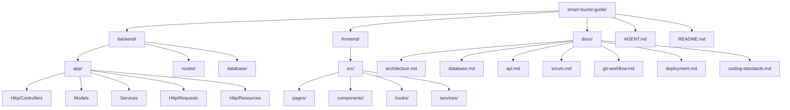

# 📁 Project Structure — Smart Tourist Guide Morocco

## Full Repository Tree

```
smart-tourist-guide/
├── backend/
│   ├── app/
│   │   ├── Console/
│   │   ├── Enums/
│   │   │   ├── BookingStatus.php
│   │   │   └── PaymentStatus.php
│   │   ├── Exceptions/
│   │   ├── Http/
│   │   │   ├── Controllers/
│   │   │   │   └── Api/
│   │   │   │       └── V1/
│   │   │   │           ├── AuthController.php
│   │   │   │           ├── RoleController.php
│   │   │   │           ├── UserController.php
│   │   │   │           ├── CityController.php
│   │   │   │           ├── AttractionController.php
│   │   │   │           ├── HotelController.php
│   │   │   │           ├── RoomController.php
│   │   │   │           ├── DriverController.php
│   │   │   │           ├── VehicleController.php
│   │   │   │           ├── HotelBookingController.php
│   │   │   │           ├── TransportBookingController.php
│   │   │   │           ├── ReviewController.php
│   │   │   │           ├── FavoriteController.php
│   │   │   │           └── AiController.php
│   │   │   ├── Middleware/
│   │   │   ├── Requests/
│   │   │   │   ├── StoreHotelBookingRequest.php
│   │   │   │   ├── StoreTransportBookingRequest.php
│   │   │   │   ├── StoreReviewRequest.php
│   │   │   │   └── ...
│   │   │   └── Resources/
│   │   │       ├── UserResource.php
│   │   │       ├── HotelResource.php
│   │   │       ├── RoomResource.php
│   │   │       ├── HotelBookingResource.php
│   │   │       └── ...
│   │   ├── Models/
│   │   │   ├── Role.php
│   │   │   ├── User.php
│   │   │   ├── City.php
│   │   │   ├── Attraction.php
│   │   │   ├── Hotel.php
│   │   │   ├── Room.php
│   │   │   ├── Driver.php
│   │   │   ├── Vehicle.php
│   │   │   ├── HotelBooking.php
│   │   │   ├── TransportBooking.php
│   │   │   ├── Review.php
│   │   │   └── Favorite.php
│   │   ├── Policies/
│   │   ├── Providers/
│   │   └── Services/
│   │       ├── HotelBookingService.php
│   │       ├── TransportBookingService.php
│   │       ├── ReviewService.php
│   │       ├── RatingCalculator.php
│   │       └── AiItineraryService.php
│   ├── bootstrap/
│   ├── config/
│   ├── database/
│   │   ├── factories/
│   │   ├── migrations/
│   │   └── seeders/
│   │       ├── RoleSeeder.php
│   │       ├── CitySeeder.php
│   │       └── DatabaseSeeder.php
│   ├── routes/
│   │   ├── api.php
│   │   ├── web.php
│   │   └── console.php
│   ├── storage/
│   ├── tests/
│   │   ├── Feature/
│   │   └── Unit/
│   ├── .env.example
│   ├── composer.json
│   └── phpunit.xml
│
├── frontend/
│   ├── public/
│   ├── src/
│   │   ├── assets/
│   │   ├── components/
│   │   │   ├── common/
│   │   │   ├── hotels/
│   │   │   ├── attractions/
│   │   │   ├── bookings/
│   │   │   └── layout/
│   │   ├── pages/
│   │   │   ├── Home.tsx
│   │   │   ├── CityDetail.tsx
│   │   │   ├── HotelDetail.tsx
│   │   │   ├── AttractionDetail.tsx
│   │   │   ├── BookingCheckout.tsx
│   │   │   ├── Dashboard/
│   │   │   │   ├── TouristDashboard.tsx
│   │   │   │   ├── HotelOwnerDashboard.tsx
│   │   │   │   └── DriverDashboard.tsx
│   │   │   └── Auth/
│   │   │       ├── Login.tsx
│   │   │       └── Register.tsx
│   │   ├── hooks/
│   │   ├── services/
│   │   │   ├── apiClient.ts
│   │   │   ├── hotelService.ts
│   │   │   ├── bookingService.ts
│   │   │   └── aiService.ts
│   │   ├── types/
│   │   ├── utils/
│   │   ├── context/
│   │   │   └── AuthContext.tsx
│   │   ├── App.tsx
│   │   └── main.tsx
│   ├── index.html
│   ├── package.json
│   ├── tsconfig.json
│   ├── vite.config.ts
│   └── .env.example
│
├── docs/
│   ├── architecture.md
│   ├── database.md
│   ├── api.md
│   ├── scrum.md
│   ├── git-workflow.md
│   ├── deployment.md
│   ├── coding-standards.md
│   └── project-structure.md
│
├── AGENT.md
├── README.md
├── docker-compose.yml (future)
└── .gitignore
```

---

## Folder Responsibility Matrix

| Path | Responsibility |
|---|---|
| `backend/app/Http/Controllers` | HTTP-layer orchestration only — no business logic |
| `backend/app/Http/Requests` | Input validation rules per endpoint |
| `backend/app/Http/Resources` | Consistent JSON response shaping |
| `backend/app/Services` | Core business logic (booking, pricing, rating calc, AI) |
| `backend/app/Models` | Eloquent models, relationships, casts, scopes |
| `backend/database/migrations` | Versioned schema definitions |
| `backend/database/seeders` | Demo/reference data (roles, cities) |
| `frontend/src/pages` | Route-level screens |
| `frontend/src/components` | Reusable presentational components |
| `frontend/src/services` | API client wrappers (one file per domain) |
| `frontend/src/hooks` | Data-fetching and stateful logic via React Query |
| `docs/` | All architectural and process documentation |

---

## Folder Structure Diagram

