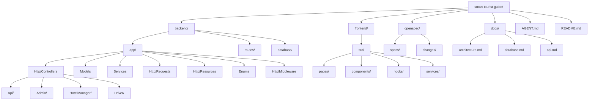

# Project Structure — Smart Tourist Guide Morocco

## Full Repository Tree

```
smart-tourist-guide/
├── backend/
│   ├── app/
│   │   ├── Console/
│   │   ├── Enums/
│   │   │   ├── Role.php
│   │   │   ├── UserStatus.php
│   │   │   ├── BookingStatus.php
│   │   │   ├── BookingType.php
│   │   │   └── TokenAbility.php
│   │   ├── Exceptions/
│   │   ├── Http/
│   │   │   ├── Controllers/
│   │   │   │   ├── Api/
│   │   │   │   │   ├── AuthController.php
│   │   │   │   │   ├── UserController.php
│   │   │   │   │   ├── CityController.php
│   │   │   │   │   ├── AttractionController.php
│   │   │   │   │   ├── HotelController.php
│   │   │   │   │   ├── RoomController.php
│   │   │   │   │   ├── DriverController.php
│   │   │   │   │   ├── VehicleController.php
│   │   │   │   │   ├── HotelBookingController.php
│   │   │   │   │   ├── TransportBookingController.php
│   │   │   │   │   ├── ReviewController.php
│   │   │   │   │   ├── FavoriteController.php
│   │   │   │   │   └── AiController.php
│   │   │   │   ├── Admin/
│   │   │   │   │   ├── AdminController.php
│   │   │   │   │   └── RoleController.php
│   │   │   │   ├── HotelManager/
│   │   │   │   │   ├── HotelController.php
│   │   │   │   │   └── RoomController.php
│   │   │   │   └── Driver/
│   │   │   │       ├── VehicleController.php
│   │   │   │       └── BookingController.php
│   │   │   ├── Middleware/
│   │   │   │   └── EnsureRoleIs.php
│   │   │   ├── Requests/
│   │   │   │   ├── RegisterUserRequest.php
│   │   │   │   ├── LoginUserRequest.php
│   │   │   │   ├── UpdateUserRequest.php
│   │   │   │   ├── Admin/
│   │   │   │   │   ├── StoreUserRequest.php
│   │   │   │   │   └── UpdateAdminUserRequest.php
│   │   │   │   └── ...
│   │   │   └── Resources/
│   │   │       ├── UserResource.php
│   │   │       ├── AdminUserResource.php
│   │   │       ├── HotelResource.php
│   │   │       ├── RoomResource.php
│   │   │       ├── BookingResource.php
│   │   │       └── ...
│   │   ├── Models/
│   │   │   ├── User.php
│   │   │   ├── City.php
│   │   │   ├── Attraction.php
│   │   │   ├── Hotel.php
│   │   │   ├── Room.php
│   │   │   ├── Driver.php
│   │   │   ├── Vehicle.php
│   │   │   ├── Booking.php
│   │   │   ├── HotelBooking.php
│   │   │   ├── TransportBooking.php
│   │   │   ├── Review.php
│   │   │   └── Favorite.php
│   │   ├── Policies/
│   │   ├── Providers/
│   │   └── Services/
│   │       ├── BookingService.php
│   │       ├── ReviewService.php
│   │       ├── FavoriteService.php
│   │       └── AiItineraryService.php
│   ├── bootstrap/
│   │   └── app.php
│   ├── config/
│   ├── database/
│   │   ├── factories/
│   │   ├── migrations/
│   │   └── seeders/
│   │       ├── CitySeeder.php
│   │       └── DatabaseSeeder.php
│   ├── routes/
│   │   ├── api.php
│   │   ├── web.php
│   │   └── console.php
│   ├── storage/
│   ├── tests/
│   │   ├── Feature/
│   │   └── Unit/
│   ├── .env.example
│   ├── composer.json
│   └── phpunit.xml
│
├── frontend/
│   ├── public/
│   ├── src/
│   │   ├── assets/
│   │   ├── components/
│   │   │   ├── common/
│   │   │   ├── hotels/
│   │   │   ├── restaurants/
│   │   │   ├── attractions/
│   │   │   ├── bookings/
│   │   │   └── layout/
│   │   ├── pages/
│   │   │   ├── Home.tsx
│   │   │   ├── CityDetail.tsx
│   │   │   ├── HotelDetail.tsx
│   │   │   ├── RestaurantDetail.tsx
│   │   │   ├── AttractionDetail.tsx
│   │   │   ├── BookingCheckout.tsx
│   │   │   ├── Dashboard/
│   │   │   │   ├── TouristDashboard.tsx
│   │   │   │   ├── HotelManagerDashboard.tsx
│   │   │   │   └── DriverDashboard.tsx
│   │   │   └── Auth/
│   │   │       ├── Login.tsx
│   │   │       └── Register.tsx
│   │   ├── hooks/
│   │   ├── services/
│   │   │   ├── apiClient.ts
│   │   │   ├── hotelService.ts
│   │   │   ├── restaurantService.ts
│   │   │   ├── bookingService.ts
│   │   │   ├── favoriteService.ts
│   │   │   └── aiService.ts
│   │   ├── types/
│   │   ├── utils/
│   │   ├── context/
│   │   │   └── AuthContext.tsx
│   │   ├── App.tsx
│   │   └── main.tsx
│   ├── index.html
│   ├── package.json
│   ├── tsconfig.json
│   ├── vite.config.ts
│   └── .env.example
│
├── openspec/
│   ├── specs/
│   │   ├── api-authentication/
│   │   ├── api-routing/
│   │   ├── attractions/
│   │   ├── backed-enums/
│   │   ├── drivers/
│   │   ├── env-configuration/
│   │   ├── favorites/
│   │   ├── hotels/
│   │   ├── rbac-middleware/
│   │   ├── reviews/
│   │   ├── user-api/
│   │   ├── user-identity/
│   │   └── vehicles-management/
│   └── changes/
│       └── archive/
│
├── docs/
│   ├── Architecture.md
│   ├── database.md
│   ├── api.md
│   ├── scrum.md
│   ├── git-workflow.md
│   ├── deployment.md
│   ├── coding-standards.md
│   └── project-structure.md
│
├── AGENT.md
├── README.md
├── docker-compose.yml (future)
└── .gitignore
```

---

## Folder Responsibility Matrix

| Path | Responsibility |
|---|---|
| `backend/app/Http/Controllers/Api` | API endpoint handlers for general users |
| `backend/app/Http/Controllers/Admin` | Admin-only CRUD operations |
| `backend/app/Http/Controllers/HotelManager` | Hotel manager operations |
| `backend/app/Http/Controllers/Driver` | Driver-specific operations |
| `backend/app/Http/Middleware` | Request filtering (role-based access) |
| `backend/app/Http/Requests` | Input validation rules per endpoint |
| `backend/app/Http/Resources` | Consistent JSON response shaping |
| `backend/app/Services` | Core business logic (booking, review, favorite, AI) |
| `backend/app/Models` | Eloquent models, relationships, casts, scopes |
| `backend/app/Enums` | PHP 8.1+ backed enums for role, status, booking type |
| `backend/database/migrations` | Versioned schema definitions |
| `backend/database/seeders` | Demo/reference data (cities) |
| `frontend/src/pages` | Route-level screens |
| `frontend/src/components` | Reusable presentational components |
| `frontend/src/services` | API client wrappers (one file per domain) |
| `frontend/src/hooks` | Data-fetching and stateful logic via React Query |
| `openspec/specs/` | System specifications and requirements |
| `docs/` | All architectural and process documentation |

---

## Controller Architecture

### Namespace Organization

```
Http/Controllers/
├── Api/                    # General API endpoints
│   ├── AuthController      # Registration, login, logout
│   ├── UserController      # User profile management
│   ├── CityController      # City CRUD
│   ├── AttractionController # Attraction CRUD
│   ├── HotelController     # Hotel listing
│   ├── RoomController      # Room listing
│   ├── DriverController    # Driver listing
│   ├── VehicleController   # Vehicle listing
│   ├── HotelBookingController # Hotel bookings
│   ├── TransportBookingController # Transport bookings
│   ├── ReviewController    # Reviews CRUD
│   ├── FavoriteController  # Favorites toggle
│   └── AiController        # AI itinerary generation
├── Admin/                  # Admin-only operations
│   ├── AdminController     # Full user CRUD + search
│   └── RoleController      # Role management
├── HotelManager/           # Hotel manager operations
│   ├── HotelController     # Manage own hotel
│   └── RoomController      # Manage own rooms
└── Driver/                 # Driver operations
    ├── VehicleController   # Manage own vehicle
    └── BookingController   # Manage transport bookings
```

### Route Protection

```php
// Public routes
Route::post('/auth/register', ...);
Route::post('/auth/login', ...);

// Authenticated routes
Route::middleware('auth:sanctum')->group(function () {
    // User profile routes
    Route::get('/user/profile', ...);
    Route::put('/user/profile/update', ...);

    // Admin routes (require Administrator role)
    Route::middleware('role:Administrator')->prefix('admin')->group(function () {
        Route::apiResource('users', Admin\AdminController::class);
    });

    // Hotel Manager routes
    Route::middleware('role:Hotel Manager')->prefix('hotel-manager')->group(function () {
        Route::apiResource('manage-hotel', ...);
    });

    // Driver routes
    Route::middleware('role:Driver')->prefix('driver')->group(function () {
        Route::apiResource('manage-vehicle', ...);
    });
});
```

---

## Middleware

### EnsureRoleIs

Checks user's `role` ENUM string directly against allowed roles.

```php
// Single role
Route::middleware('role:Administrator');

// Multiple roles
Route::middleware('role:Administrator,Driver');
```

**Values:** `Tourist`, `Driver`, `Hotel Manager`, `Administrator`

---

## Form Requests

### Auth Requests

| Request | Purpose |
|---------|---------|
| `RegisterUserRequest` | Registration validation (conditional Driver fields) |
| `LoginUserRequest` | Login validation |
| `UpdateUserRequest` | User profile update (first_name, last_name, email, phone) |

### Admin Requests

| Request | Purpose |
|---------|---------|
| `StoreUserRequest` | Create user (admin, auto-creates Driver profile) |
| `UpdateAdminUserRequest` | Update any user (role, status, active) |

---

## API Resources

### User Resources

| Resource | Purpose |
|----------|---------|
| `UserResource` | User profile response (own profile) |
| `AdminUserResource` | Admin user response (includes timestamps, bookings count) |

---

## Folder Structure Diagram


