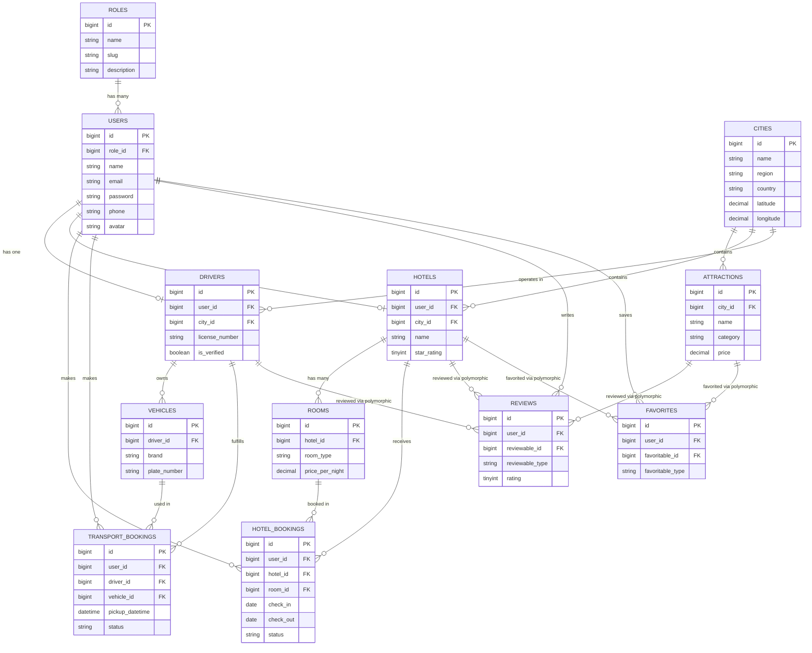

# 🗄️ Database Design — Smart Tourist Guide Morocco

> Complete relational schema documentation for the Smart Tourist Guide Morocco platform. This document is the source of truth for all database tables, relationships, business rules, and Laravel ORM mappings.

---

## 📑 Table of Contents

1. [Overview](#overview)
2. [Entity Relationship Diagram](#entity-relationship-diagram)
3. [Relationship Table](#relationship-table)
4. [Table Documentation](#table-documentation)
   - [roles](#roles)
   - [users](#users)
   - [cities](#cities)
   - [attractions](#attractions)
   - [hotels](#hotels)
   - [rooms](#rooms)
   - [drivers](#drivers)
   - [vehicles](#vehicles)
   - [hotel_bookings](#hotel_bookings)
   - [transport_bookings](#transport_bookings)
   - [reviews](#reviews)
   - [favorites](#favorites)
5. [Indexing Strategy](#indexing-strategy)
6. [Polymorphic Relationships Notes](#polymorphic-relationships-notes)

---

## Overview

The database is designed for a **multi-role tourism platform** covering three core domains:

| Domain | Tables |
|---|---|
| **Identity & Access** | `roles`, `users` |
| **Catalog** | `cities`, `attractions`, `hotels`, `rooms`, `drivers`, `vehicles` |
| **Transactions** | `hotel_bookings`, `transport_bookings` |
| **Engagement** | `reviews`, `favorites` |

Engine: **MySQL 8.0** (InnoDB), charset `utf8mb4`, collation `utf8mb4_unicode_ci`.
All primary keys are unsigned `BIGINT` auto-increment (Laravel default `id()`).
All tables use Laravel's standard `created_at` / `updated_at` timestamps, and `hotels`/`rooms`/`attractions` additionally support soft deletes (`deleted_at`).

---

## Entity Relationship Diagram



---

## Relationship Table

| Table | Relationship | Target | Foreign Key | On Delete |
|---|---|---|---|---|
| users | belongsTo | roles | `role_id` | restrict |
| hotels | belongsTo | users | `user_id` | cascade |
| hotels | belongsTo | cities | `city_id` | restrict |
| rooms | belongsTo | hotels | `hotel_id` | cascade |
| attractions | belongsTo | cities | `city_id` | restrict |
| drivers | belongsTo | users | `user_id` | cascade |
| drivers | belongsTo | cities | `city_id` | restrict |
| vehicles | belongsTo | drivers | `driver_id` | cascade |
| hotel_bookings | belongsTo | users | `user_id` | cascade |
| hotel_bookings | belongsTo | hotels | `hotel_id` | cascade |
| hotel_bookings | belongsTo | rooms | `room_id` | cascade |
| transport_bookings | belongsTo | users | `user_id` | cascade |
| transport_bookings | belongsTo | drivers | `driver_id` | cascade |
| transport_bookings | belongsTo | vehicles | `vehicle_id` | cascade |
| reviews | belongsTo | users | `user_id` | cascade |
| reviews | morphTo | attractions / hotels / drivers | `reviewable_id`, `reviewable_type` | cascade |
| favorites | belongsTo | users | `user_id` | cascade |
| favorites | morphTo | attractions / hotels | `favoritable_id`, `favoritable_type` | cascade |

---

## Table Documentation

## roles

### Purpose
Defines the set of access levels / personas available on the platform (Admin, Tourist, Hotel Owner, Driver).

### Description
A lightweight lookup table that drives role-based access control (RBAC) across the application. Every user is assigned exactly one role, which determines their dashboard, permissions, and available API scopes.

### Columns

| Column | Type | Nullable | Default | Description |
|---|---|---|---|---|
| id | BIGINT UNSIGNED (PK) | No | auto | Primary key |
| name | VARCHAR(50) | No | — | Display name (e.g. `Admin`, `Tourist`, `Hotel Owner`, `Driver`) |
| slug | VARCHAR(50) | No | — | Machine-readable identifier (e.g. `admin`, `tourist`) |
| description | VARCHAR(255) | Yes | NULL | Human-readable description of the role's scope |
| created_at | TIMESTAMP | Yes | NULL | Record creation timestamp |
| updated_at | TIMESTAMP | Yes | NULL | Record update timestamp |

### Data Types
`id`: `bigIncrements` · `name`, `slug`, `description`: `string` · timestamps: `timestamp`

### Relationships
- `roles` **hasMany** `users`

### Business Rules
- A role cannot be deleted if users are currently assigned to it (restrict on delete).
- The four core roles (`admin`, `tourist`, `hotel_owner`, `driver`) are seeded and should not be removed via the UI.
- `slug` must be unique and lowercase, snake_case.

### Laravel Relationships
```php
class Role extends Model
{
    public function users(): HasMany
    {
        return $this->hasMany(User::class);
    }
}
```

### Validation Rules
```php
'name'        => 'required|string|max:50',
'slug'        => 'required|string|max:50|unique:roles,slug',
'description' => 'nullable|string|max:255',
```

### Indexes
- PRIMARY KEY (`id`)
- UNIQUE INDEX `roles_slug_unique` (`slug`)

### Example Record
```json
{
  "id": 2,
  "name": "Tourist",
  "slug": "tourist",
  "description": "Standard platform visitor who books hotels and transport.",
  "created_at": "2026-01-10T09:00:00Z",
  "updated_at": "2026-01-10T09:00:00Z"
}
```

---

## users

### Purpose
Stores all authenticated users of the platform, regardless of role (tourist, hotel owner, driver, admin).

### Description
Central identity table. Every actor in the system — whether booking a room, driving tourists, or managing a hotel — is represented as a row here, differentiated by `role_id`. Authentication (Laravel Sanctum/Breeze) and profile data live in this table.

### Columns

| Column | Type | Nullable | Default | Description |
|---|---|---|---|---|
| id | BIGINT UNSIGNED (PK) | No | auto | Primary key |
| role_id | BIGINT UNSIGNED (FK) | No | — | References `roles.id` |
| name | VARCHAR(150) | No | — | Full name |
| email | VARCHAR(150) | No | — | Unique login email |
| email_verified_at | TIMESTAMP | Yes | NULL | Email verification timestamp |
| password | VARCHAR(255) | No | — | Hashed password (bcrypt) |
| phone | VARCHAR(20) | Yes | NULL | Contact phone number |
| avatar | VARCHAR(255) | Yes | NULL | Path/URL to profile picture |
| is_active | BOOLEAN | No | true | Account status flag |
| remember_token | VARCHAR(100) | Yes | NULL | Laravel "remember me" token |
| created_at | TIMESTAMP | Yes | NULL | Record creation timestamp |
| updated_at | TIMESTAMP | Yes | NULL | Record update timestamp |

### Data Types
`id`, `role_id`: `bigInteger` · `name`, `email`, `password`, `phone`, `avatar`, `remember_token`: `string` · `email_verified_at`: `timestamp` · `is_active`: `boolean`

### Relationships
- `users` **belongsTo** `roles`
- `users` **hasOne** `drivers`
- `users` **hasOne** `hotels`
- `users` **hasMany** `hotel_bookings`
- `users` **hasMany** `transport_bookings`
- `users` **hasMany** `reviews`
- `users` **hasMany** `favorites`

### Business Rules
- A user must have exactly one role.
- Only authenticated users can create bookings.
- A tourist can create reviews only after completing a booking.
- A user with role `driver` must complete their `drivers` profile before accepting transport bookings.
- A user with role `hotel_owner` must have at least one `hotels` record to publish rooms.
- Deactivated users (`is_active = false`) cannot log in or create new bookings.

### Laravel Relationships
```php
class User extends Authenticatable
{
    public function role(): BelongsTo
    {
        return $this->belongsTo(Role::class);
    }

    public function driver(): HasOne
    {
        return $this->hasOne(Driver::class);
    }

    public function hotel(): HasOne
    {
        return $this->hasOne(Hotel::class);
    }

    public function hotelBookings(): HasMany
    {
        return $this->hasMany(HotelBooking::class);
    }

    public function transportBookings(): HasMany
    {
        return $this->hasMany(TransportBooking::class);
    }

    public function reviews(): HasMany
    {
        return $this->hasMany(Review::class);
    }

    public function favorites(): HasMany
    {
        return $this->hasMany(Favorite::class);
    }
}
```

### Validation Rules
```php
'role_id'  => 'required|exists:roles,id',
'name'     => 'required|string|max:150',
'email'    => 'required|email|unique:users,email',
'password' => 'required|string|min:8|confirmed',
'phone'    => 'nullable|string|max:20',
'avatar'   => 'nullable|image|max:2048',
```

### Indexes
- PRIMARY KEY (`id`)
- UNIQUE INDEX `users_email_unique` (`email`)
- INDEX `users_role_id_index` (`role_id`)

### Example Record
```json
{
  "id": 15,
  "role_id": 2,
  "name": "Yasmine El Amrani",
  "email": "yasmine.elamrani@example.com",
  "email_verified_at": "2026-02-01T12:00:00Z",
  "phone": "+212612345678",
  "avatar": "avatars/yasmine.jpg",
  "is_active": true,
  "created_at": "2026-01-15T08:30:00Z",
  "updated_at": "2026-02-01T12:00:00Z"
}
```

---

## cities

### Purpose
Stores Moroccan cities/regions available for tourism discovery.

### Description
Acts as the primary geographic anchor for the catalog. Attractions, hotels, and drivers are all scoped to a city, enabling location-based search and filtering across the platform.

### Columns

| Column | Type | Nullable | Default | Description |
|---|---|---|---|---|
| id | BIGINT UNSIGNED (PK) | No | auto | Primary key |
| name | VARCHAR(100) | No | — | City name (e.g. `Marrakech`) |
| region | VARCHAR(100) | Yes | NULL | Administrative region |
| country | VARCHAR(100) | No | 'Morocco' | Country name |
| description | TEXT | Yes | NULL | Overview text for the city landing page |
| image | VARCHAR(255) | Yes | NULL | Cover image path/URL |
| latitude | DECIMAL(10,7) | Yes | NULL | Geographic latitude |
| longitude | DECIMAL(10,7) | Yes | NULL | Geographic longitude |
| created_at | TIMESTAMP | Yes | NULL | Record creation timestamp |
| updated_at | TIMESTAMP | Yes | NULL | Record update timestamp |

### Data Types
`id`: `bigIncrements` · `name`, `region`, `country`, `image`: `string` · `description`: `text` · `latitude`, `longitude`: `decimal(10,7)`

### Relationships
- `cities` **hasMany** `attractions`
- `cities` **hasMany** `hotels`
- `cities` **hasMany** `drivers`

### Business Rules
- City name must be unique per country.
- A city cannot be deleted if it has associated attractions, hotels, or drivers (restrict on delete).
- Coordinates, if provided, must fall within valid WGS84 ranges.

### Laravel Relationships
```php
class City extends Model
{
    public function attractions(): HasMany
    {
        return $this->hasMany(Attraction::class);
    }

    public function hotels(): HasMany
    {
        return $this->hasMany(Hotel::class);
    }

    public function drivers(): HasMany
    {
        return $this->hasMany(Driver::class);
    }
}
```

### Validation Rules
```php
'name'        => 'required|string|max:100|unique:cities,name',
'region'      => 'nullable|string|max:100',
'country'     => 'required|string|max:100',
'description' => 'nullable|string',
'image'       => 'nullable|image|max:4096',
'latitude'    => 'nullable|numeric|between:-90,90',
'longitude'   => 'nullable|numeric|between:-180,180',
```

### Indexes
- PRIMARY KEY (`id`)
- UNIQUE INDEX `cities_name_unique` (`name`)
- INDEX `cities_region_index` (`region`)

### Example Record
```json
{
  "id": 1,
  "name": "Marrakech",
  "region": "Marrakech-Safi",
  "country": "Morocco",
  "description": "The Red City, famed for its medina, souks, and Jemaa el-Fnaa square.",
  "image": "cities/marrakech.jpg",
  "latitude": 31.6295,
  "longitude": -7.9811,
  "created_at": "2026-01-05T10:00:00Z",
  "updated_at": "2026-01-05T10:00:00Z"
}
```

---

## attractions

### Purpose
Stores tourist attractions (monuments, museums, natural sites, activities) available for discovery within a city.

### Description
The core content catalog entity for tourism discovery. Each attraction belongs to a city and can be reviewed and favorited by tourists, powering the recommendation and search features of the platform.

### Columns

| Column | Type | Nullable | Default | Description |
|---|---|---|---|---|
| id | BIGINT UNSIGNED (PK) | No | auto | Primary key |
| city_id | BIGINT UNSIGNED (FK) | No | — | References `cities.id` |
| name | VARCHAR(150) | No | — | Attraction name |
| slug | VARCHAR(180) | No | — | URL-friendly identifier |
| description | TEXT | Yes | NULL | Full description |
| category | VARCHAR(50) | No | — | e.g. `historical`, `nature`, `museum`, `adventure` |
| image | VARCHAR(255) | Yes | NULL | Cover image path/URL |
| latitude | DECIMAL(10,7) | Yes | NULL | Geographic latitude |
| longitude | DECIMAL(10,7) | Yes | NULL | Geographic longitude |
| price | DECIMAL(8,2) | Yes | 0.00 | Entry price (0 = free) |
| opening_hours | VARCHAR(100) | Yes | NULL | Human-readable opening hours |
| average_rating | DECIMAL(3,2) | No | 0.00 | Cached average of related reviews |
| is_active | BOOLEAN | No | true | Visibility flag |
| created_at | TIMESTAMP | Yes | NULL | Record creation timestamp |
| updated_at | TIMESTAMP | Yes | NULL | Record update timestamp |
| deleted_at | TIMESTAMP | Yes | NULL | Soft delete timestamp |

### Data Types
`id`, `city_id`: `bigInteger` · `name`, `slug`, `category`, `image`, `opening_hours`: `string` · `description`: `text` · `latitude`, `longitude`: `decimal(10,7)` · `price`: `decimal(8,2)` · `average_rating`: `decimal(3,2)` · `is_active`: `boolean`

### Relationships
- `attractions` **belongsTo** `cities`
- `attractions` **morphMany** `reviews` (as `reviewable`)
- `attractions` **morphMany** `favorites` (as `favoritable`)

### Business Rules
- Every attraction must belong to a valid city.
- `average_rating` is recalculated automatically whenever a related review is created, updated, or deleted.
- Soft-deleted attractions are hidden from search/discovery but preserved for historical review integrity.
- `price = 0` denotes free entry and is displayed as "Free" in the UI.

### Laravel Relationships
```php
class Attraction extends Model
{
    use SoftDeletes;

    public function city(): BelongsTo
    {
        return $this->belongsTo(City::class);
    }

    public function reviews(): MorphMany
    {
        return $this->morphMany(Review::class, 'reviewable');
    }

    public function favorites(): MorphMany
    {
        return $this->morphMany(Favorite::class, 'favoritable');
    }
}
```

### Validation Rules
```php
'city_id'        => 'required|exists:cities,id',
'name'           => 'required|string|max:150',
'slug'           => 'required|string|max:180|unique:attractions,slug',
'description'    => 'nullable|string',
'category'       => 'required|string|max:50',
'image'          => 'nullable|image|max:4096',
'latitude'       => 'nullable|numeric|between:-90,90',
'longitude'      => 'nullable|numeric|between:-180,180',
'price'          => 'nullable|numeric|min:0',
'opening_hours'  => 'nullable|string|max:100',
```

### Indexes
- PRIMARY KEY (`id`)
- UNIQUE INDEX `attractions_slug_unique` (`slug`)
- INDEX `attractions_city_id_index` (`city_id`)
- INDEX `attractions_category_index` (`category`)

### Example Record
```json
{
  "id": 8,
  "city_id": 1,
  "name": "Jardin Majorelle",
  "slug": "jardin-majorelle",
  "description": "A botanical garden and artist's landscape garden in Marrakech.",
  "category": "nature",
  "image": "attractions/jardin-majorelle.jpg",
  "latitude": 31.6417,
  "longitude": -8.0033,
  "price": 15.00,
  "opening_hours": "08:00 - 18:00",
  "average_rating": 4.7,
  "is_active": true,
  "created_at": "2026-01-06T11:00:00Z",
  "updated_at": "2026-02-10T09:00:00Z"
}
```

---

## hotels

### Purpose
Stores hotel listings managed by hotel-owner users.

### Description
Represents a lodging establishment offered on the platform. Each hotel is owned by exactly one `hotel_owner` user and belongs to a city, and exposes a set of bookable `rooms`.

### Columns

| Column | Type | Nullable | Default | Description |
|---|---|---|---|---|
| id | BIGINT UNSIGNED (PK) | No | auto | Primary key |
| user_id | BIGINT UNSIGNED (FK) | No | — | Owning user (role = hotel_owner) |
| city_id | BIGINT UNSIGNED (FK) | No | — | References `cities.id` |
| name | VARCHAR(150) | No | — | Hotel name |
| slug | VARCHAR(180) | No | — | URL-friendly identifier |
| description | TEXT | Yes | NULL | Full description / amenities summary |
| address | VARCHAR(255) | No | — | Street address |
| star_rating | TINYINT UNSIGNED | Yes | NULL | Official star classification (1-5) |
| image | VARCHAR(255) | Yes | NULL | Cover image path/URL |
| latitude | DECIMAL(10,7) | Yes | NULL | Geographic latitude |
| longitude | DECIMAL(10,7) | Yes | NULL | Geographic longitude |
| phone | VARCHAR(20) | Yes | NULL | Contact phone |
| email | VARCHAR(150) | Yes | NULL | Contact email |
| is_active | BOOLEAN | No | true | Visibility / approval flag |
| created_at | TIMESTAMP | Yes | NULL | Record creation timestamp |
| updated_at | TIMESTAMP | Yes | NULL | Record update timestamp |
| deleted_at | TIMESTAMP | Yes | NULL | Soft delete timestamp |

### Data Types
`id`, `user_id`, `city_id`: `bigInteger` · `name`, `slug`, `address`, `image`, `phone`, `email`: `string` · `description`: `text` · `star_rating`: `tinyInteger` · `latitude`, `longitude`: `decimal(10,7)` · `is_active`: `boolean`

### Relationships
- `hotels` **belongsTo** `users` (owner)
- `hotels` **belongsTo** `cities`
- `hotels` **hasMany** `rooms`
- `hotels` **hasMany** `hotel_bookings`
- `hotels` **morphMany** `reviews` (as `reviewable`)
- `hotels` **morphMany** `favorites` (as `favoritable`)

### Business Rules
- A hotel must belong to exactly one owner and one city.
- Only users with role `hotel_owner` may own a hotel.
- A hotel must have `is_active = true` and at least one active room to appear in search results.
- Deleting a hotel cascades to its rooms but is blocked while active bookings exist.

### Laravel Relationships
```php
class Hotel extends Model
{
    use SoftDeletes;

    public function owner(): BelongsTo
    {
        return $this->belongsTo(User::class, 'user_id');
    }

    public function city(): BelongsTo
    {
        return $this->belongsTo(City::class);
    }

    public function rooms(): HasMany
    {
        return $this->hasMany(Room::class);
    }

    public function bookings(): HasMany
    {
        return $this->hasMany(HotelBooking::class);
    }

    public function reviews(): MorphMany
    {
        return $this->morphMany(Review::class, 'reviewable');
    }

    public function favorites(): MorphMany
    {
        return $this->morphMany(Favorite::class, 'favoritable');
    }
}
```

### Validation Rules
```php
'user_id'     => 'required|exists:users,id',
'city_id'     => 'required|exists:cities,id',
'name'        => 'required|string|max:150',
'slug'        => 'required|string|max:180|unique:hotels,slug',
'description' => 'nullable|string',
'address'     => 'required|string|max:255',
'star_rating' => 'nullable|integer|between:1,5',
'image'       => 'nullable|image|max:4096',
'phone'       => 'nullable|string|max:20',
'email'       => 'nullable|email|max:150',
```

### Indexes
- PRIMARY KEY (`id`)
- UNIQUE INDEX `hotels_slug_unique` (`slug`)
- INDEX `hotels_city_id_index` (`city_id`)
- INDEX `hotels_user_id_index` (`user_id`)

### Example Record
```json
{
  "id": 4,
  "user_id": 22,
  "city_id": 1,
  "name": "Riad Atlas Dream",
  "slug": "riad-atlas-dream",
  "description": "A boutique riad in the heart of the Marrakech medina.",
  "address": "12 Derb El Hammam, Medina, Marrakech",
  "star_rating": 4,
  "image": "hotels/riad-atlas-dream.jpg",
  "latitude": 31.6295,
  "longitude": -7.9811,
  "phone": "+212524123456",
  "email": "contact@riadatlasdream.ma",
  "is_active": true,
  "created_at": "2026-01-12T09:00:00Z",
  "updated_at": "2026-02-01T09:00:00Z"
}
```

---

## rooms

### Purpose
Stores individual room types/inventory offered by a hotel.

### Description
Represents a bookable unit within a hotel (e.g. "Deluxe Double Room"). Rooms hold pricing and capacity information used by the booking engine to compute availability and price.

### Columns

| Column | Type | Nullable | Default | Description |
|---|---|---|---|---|
| id | BIGINT UNSIGNED (PK) | No | auto | Primary key |
| hotel_id | BIGINT UNSIGNED (FK) | No | — | References `hotels.id` |
| room_type | VARCHAR(100) | No | — | e.g. `Single`, `Double`, `Suite` |
| description | TEXT | Yes | NULL | Room description / amenities |
| capacity | TINYINT UNSIGNED | No | 2 | Max number of guests |
| price_per_night | DECIMAL(8,2) | No | — | Nightly rate |
| quantity_available | SMALLINT UNSIGNED | No | 1 | Total units of this room type |
| image | VARCHAR(255) | Yes | NULL | Room image path/URL |
| is_active | BOOLEAN | No | true | Availability toggle |
| created_at | TIMESTAMP | Yes | NULL | Record creation timestamp |
| updated_at | TIMESTAMP | Yes | NULL | Record update timestamp |
| deleted_at | TIMESTAMP | Yes | NULL | Soft delete timestamp |

### Data Types
`id`, `hotel_id`: `bigInteger` · `room_type`, `image`: `string` · `description`: `text` · `capacity`: `tinyInteger` · `price_per_night`: `decimal(8,2)` · `quantity_available`: `smallInteger` · `is_active`: `boolean`

### Relationships
- `rooms` **belongsTo** `hotels`
- `rooms` **hasMany** `hotel_bookings`

### Business Rules
- `price_per_night` must be greater than 0.
- A room cannot be booked if `quantity_available` minus overlapping confirmed bookings for the requested dates is 0.
- `capacity` must be respected by the `guests` value on `hotel_bookings`.

### Laravel Relationships
```php
class Room extends Model
{
    use SoftDeletes;

    public function hotel(): BelongsTo
    {
        return $this->belongsTo(Hotel::class);
    }

    public function bookings(): HasMany
    {
        return $this->hasMany(HotelBooking::class);
    }
}
```

### Validation Rules
```php
'hotel_id'            => 'required|exists:hotels,id',
'room_type'           => 'required|string|max:100',
'description'         => 'nullable|string',
'capacity'            => 'required|integer|min:1|max:20',
'price_per_night'     => 'required|numeric|min:0.01',
'quantity_available'  => 'required|integer|min:0',
'image'               => 'nullable|image|max:4096',
```

### Indexes
- PRIMARY KEY (`id`)
- INDEX `rooms_hotel_id_index` (`hotel_id`)
- INDEX `rooms_price_per_night_index` (`price_per_night`)

### Example Record
```json
{
  "id": 11,
  "hotel_id": 4,
  "room_type": "Deluxe Double Room",
  "description": "20m² room with courtyard view, en-suite bathroom, A/C.",
  "capacity": 2,
  "price_per_night": 85.00,
  "quantity_available": 3,
  "image": "rooms/riad-deluxe-double.jpg",
  "is_active": true,
  "created_at": "2026-01-12T09:15:00Z",
  "updated_at": "2026-01-12T09:15:00Z"
}
```

---

## drivers

### Purpose
Stores driver profiles for the transport/ride-booking module.

### Description
Extends a `user` (role = `driver`) with transport-specific credentials, such as license and city of operation. A driver may own multiple `vehicles`.

### Columns

| Column | Type | Nullable | Default | Description |
|---|---|---|---|---|
| id | BIGINT UNSIGNED (PK) | No | auto | Primary key |
| user_id | BIGINT UNSIGNED (FK) | No | — | References `users.id` |
| city_id | BIGINT UNSIGNED (FK) | No | — | Primary city of operation |
| license_number | VARCHAR(50) | No | — | Driving license number |
| license_expiry | DATE | Yes | NULL | License expiration date |
| is_verified | BOOLEAN | No | false | Admin verification status |
| rating | DECIMAL(3,2) | No | 0.00 | Cached average rating |
| bio | TEXT | Yes | NULL | Short driver bio |
| created_at | TIMESTAMP | Yes | NULL | Record creation timestamp |
| updated_at | TIMESTAMP | Yes | NULL | Record update timestamp |

### Data Types
`id`, `user_id`, `city_id`: `bigInteger` · `license_number`: `string` · `license_expiry`: `date` · `is_verified`: `boolean` · `rating`: `decimal(3,2)` · `bio`: `text`

### Relationships
- `drivers` **belongsTo** `users`
- `drivers` **belongsTo** `cities`
- `drivers` **hasMany** `vehicles`
- `drivers` **hasMany** `transport_bookings`
- `drivers` **morphMany** `reviews` (as `reviewable`)

### Business Rules
- A driver profile requires a unique `license_number`.
- A driver cannot accept bookings until `is_verified = true`.
- `rating` is recalculated whenever a related review is created, updated, or deleted.
- Each driver must be linked to a `user` with role `driver`.

### Laravel Relationships
```php
class Driver extends Model
{
    public function user(): BelongsTo
    {
        return $this->belongsTo(User::class);
    }

    public function city(): BelongsTo
    {
        return $this->belongsTo(City::class);
    }

    public function vehicles(): HasMany
    {
        return $this->hasMany(Vehicle::class);
    }

    public function bookings(): HasMany
    {
        return $this->hasMany(TransportBooking::class);
    }

    public function reviews(): MorphMany
    {
        return $this->morphMany(Review::class, 'reviewable');
    }
}
```

### Validation Rules
```php
'user_id'         => 'required|exists:users,id|unique:drivers,user_id',
'city_id'         => 'required|exists:cities,id',
'license_number'  => 'required|string|max:50|unique:drivers,license_number',
'license_expiry'  => 'nullable|date|after:today',
'bio'             => 'nullable|string|max:1000',
```

### Indexes
- PRIMARY KEY (`id`)
- UNIQUE INDEX `drivers_user_id_unique` (`user_id`)
- UNIQUE INDEX `drivers_license_number_unique` (`license_number`)
- INDEX `drivers_city_id_index` (`city_id`)

### Example Record
```json
{
  "id": 6,
  "user_id": 31,
  "city_id": 1,
  "license_number": "MA-2024-88213",
  "license_expiry": "2028-06-30",
  "is_verified": true,
  "rating": 4.85,
  "bio": "10 years of experience driving tourists across the Atlas region.",
  "created_at": "2026-01-18T10:00:00Z",
  "updated_at": "2026-02-05T10:00:00Z"
}
```

---

## vehicles

### Purpose
Stores vehicles owned/operated by drivers for transport bookings.

### Description
Represents a physical vehicle that can be assigned to a `transport_booking`. Each vehicle belongs to exactly one driver and carries pricing/capacity attributes used for fare estimation.

### Columns

| Column | Type | Nullable | Default | Description |
|---|---|---|---|---|
| id | BIGINT UNSIGNED (PK) | No | auto | Primary key |
| driver_id | BIGINT UNSIGNED (FK) | No | — | References `drivers.id` |
| brand | VARCHAR(50) | No | — | Vehicle brand (e.g. `Dacia`) |
| model | VARCHAR(50) | No | — | Vehicle model (e.g. `Duster`) |
| plate_number | VARCHAR(20) | No | — | License plate |
| type | VARCHAR(30) | No | — | `sedan`, `suv`, `van`, `minibus` |
| capacity | TINYINT UNSIGNED | No | 4 | Passenger capacity |
| price_per_km | DECIMAL(6,2) | No | — | Rate per kilometer (MAD) |
| image | VARCHAR(255) | Yes | NULL | Vehicle photo |
| is_active | BOOLEAN | No | true | Availability toggle |
| created_at | TIMESTAMP | Yes | NULL | Record creation timestamp |
| updated_at | TIMESTAMP | Yes | NULL | Record update timestamp |

### Data Types
`id`, `driver_id`: `bigInteger` · `brand`, `model`, `plate_number`, `type`, `image`: `string` · `capacity`: `tinyInteger` · `price_per_km`: `decimal(6,2)` · `is_active`: `boolean`

### Relationships
- `vehicles` **belongsTo** `drivers`
- `vehicles` **hasMany** `transport_bookings`

### Business Rules
- `plate_number` must be unique across the platform.
- A vehicle must belong to a verified driver to be bookable.
- `price_per_km` must be greater than 0.

### Laravel Relationships
```php
class Vehicle extends Model
{
    public function driver(): BelongsTo
    {
        return $this->belongsTo(Driver::class);
    }

    public function bookings(): HasMany
    {
        return $this->hasMany(TransportBooking::class);
    }
}
```

### Validation Rules
```php
'driver_id'     => 'required|exists:drivers,id',
'brand'         => 'required|string|max:50',
'model'         => 'required|string|max:50',
'plate_number'  => 'required|string|max:20|unique:vehicles,plate_number',
'type'          => 'required|in:sedan,suv,van,minibus',
'capacity'      => 'required|integer|min:1|max:50',
'price_per_km'  => 'required|numeric|min:0.01',
'image'         => 'nullable|image|max:4096',
```

### Indexes
- PRIMARY KEY (`id`)
- UNIQUE INDEX `vehicles_plate_number_unique` (`plate_number`)
- INDEX `vehicles_driver_id_index` (`driver_id`)
- INDEX `vehicles_type_index` (`type`)

### Example Record
```json
{
  "id": 9,
  "driver_id": 6,
  "brand": "Dacia",
  "model": "Duster",
  "plate_number": "12345-A-6",
  "type": "suv",
  "capacity": 4,
  "price_per_km": 3.50,
  "image": "vehicles/dacia-duster-9.jpg",
  "is_active": true,
  "created_at": "2026-01-18T10:10:00Z",
  "updated_at": "2026-01-18T10:10:00Z"
}
```

---

## hotel_bookings

### Purpose
Stores reservations made by tourists for hotel rooms.

### Description
The transactional record linking a `user`, a `hotel`, and a specific `room` for a date range. Drives the booking engine, payment status tracking, and post-stay review eligibility.

### Columns

| Column | Type | Nullable | Default | Description |
|---|---|---|---|---|
| id | BIGINT UNSIGNED (PK) | No | auto | Primary key |
| user_id | BIGINT UNSIGNED (FK) | No | — | Booking tourist |
| hotel_id | BIGINT UNSIGNED (FK) | No | — | References `hotels.id` |
| room_id | BIGINT UNSIGNED (FK) | No | — | References `rooms.id` |
| check_in | DATE | No | — | Check-in date |
| check_out | DATE | No | — | Check-out date |
| guests | TINYINT UNSIGNED | No | 1 | Number of guests |
| total_price | DECIMAL(10,2) | No | — | Computed total for the stay |
| status | ENUM | No | 'pending' | `pending`, `confirmed`, `cancelled`, `completed` |
| payment_status | ENUM | No | 'unpaid' | `unpaid`, `paid`, `refunded` |
| notes | TEXT | Yes | NULL | Special requests |
| created_at | TIMESTAMP | Yes | NULL | Record creation timestamp |
| updated_at | TIMESTAMP | Yes | NULL | Record update timestamp |

### Data Types
`id`, `user_id`, `hotel_id`, `room_id`: `bigInteger` · `check_in`, `check_out`: `date` · `guests`: `tinyInteger` · `total_price`: `decimal(10,2)` · `status`, `payment_status`: `enum` (stored as `string`) · `notes`: `text`

### Relationships
- `hotel_bookings` **belongsTo** `users`
- `hotel_bookings` **belongsTo** `hotels`
- `hotel_bookings` **belongsTo** `rooms`

### Business Rules
- `check_out` must be strictly after `check_in`.
- `total_price` = `room.price_per_night` × number of nights (computed server-side, never trusted from client).
- A booking can only transition `pending → confirmed → completed`, or to `cancelled` from `pending`/`confirmed`.
- A review for the related hotel can only be submitted once `status = completed`.
- Overlapping bookings for the same `room_id` are rejected if available quantity would be exceeded.

### Laravel Relationships
```php
class HotelBooking extends Model
{
    public function user(): BelongsTo
    {
        return $this->belongsTo(User::class);
    }

    public function hotel(): BelongsTo
    {
        return $this->belongsTo(Hotel::class);
    }

    public function room(): BelongsTo
    {
        return $this->belongsTo(Room::class);
    }
}
```

### Validation Rules
```php
'user_id'    => 'required|exists:users,id',
'hotel_id'   => 'required|exists:hotels,id',
'room_id'    => 'required|exists:rooms,id',
'check_in'   => 'required|date|after_or_equal:today',
'check_out'  => 'required|date|after:check_in',
'guests'     => 'required|integer|min:1',
'notes'      => 'nullable|string|max:1000',
```

### Indexes
- PRIMARY KEY (`id`)
- INDEX `hotel_bookings_user_id_index` (`user_id`)
- INDEX `hotel_bookings_hotel_id_index` (`hotel_id`)
- INDEX `hotel_bookings_room_id_index` (`room_id`)
- INDEX `hotel_bookings_status_index` (`status`)
- COMPOSITE INDEX `hotel_bookings_room_dates_index` (`room_id`, `check_in`, `check_out`)

### Example Record
```json
{
  "id": 102,
  "user_id": 15,
  "hotel_id": 4,
  "room_id": 11,
  "check_in": "2026-03-10",
  "check_out": "2026-03-14",
  "guests": 2,
  "total_price": 340.00,
  "status": "confirmed",
  "payment_status": "paid",
  "notes": "Late check-in around 22:00.",
  "created_at": "2026-02-20T14:00:00Z",
  "updated_at": "2026-02-20T14:05:00Z"
}
```

---

## transport_bookings

### Purpose
Stores reservations made by tourists for driver/vehicle transport services.

### Description
The transactional record linking a `user`, a `driver`, and a `vehicle` for a pickup/dropoff journey. Powers fare calculation, driver assignment, and post-trip review eligibility.

### Columns

| Column | Type | Nullable | Default | Description |
|---|---|---|---|---|
| id | BIGINT UNSIGNED (PK) | No | auto | Primary key |
| user_id | BIGINT UNSIGNED (FK) | No | — | Booking tourist |
| driver_id | BIGINT UNSIGNED (FK) | No | — | References `drivers.id` |
| vehicle_id | BIGINT UNSIGNED (FK) | No | — | References `vehicles.id` |
| pickup_location | VARCHAR(255) | No | — | Pickup address/description |
| dropoff_location | VARCHAR(255) | No | — | Dropoff address/description |
| pickup_datetime | DATETIME | No | — | Scheduled pickup date/time |
| distance_km | DECIMAL(6,2) | Yes | NULL | Estimated/actual distance |
| total_price | DECIMAL(10,2) | No | — | Computed fare |
| status | ENUM | No | 'pending' | `pending`, `confirmed`, `in_progress`, `completed`, `cancelled` |
| created_at | TIMESTAMP | Yes | NULL | Record creation timestamp |
| updated_at | TIMESTAMP | Yes | NULL | Record update timestamp |

### Data Types
`id`, `user_id`, `driver_id`, `vehicle_id`: `bigInteger` · `pickup_location`, `dropoff_location`: `string` · `pickup_datetime`: `datetime` · `distance_km`: `decimal(6,2)` · `total_price`: `decimal(10,2)` · `status`: `enum` (stored as `string`)

### Relationships
- `transport_bookings` **belongsTo** `users`
- `transport_bookings` **belongsTo** `drivers`
- `transport_bookings` **belongsTo** `vehicles`

### Business Rules
- `total_price` = `vehicle.price_per_km` × `distance_km` (computed server-side).
- `vehicle_id` must belong to the selected `driver_id`.
- A booking can only transition `pending → confirmed → in_progress → completed`, or to `cancelled` from `pending`/`confirmed`.
- A review for the related driver can only be submitted once `status = completed`.

### Laravel Relationships
```php
class TransportBooking extends Model
{
    public function user(): BelongsTo
    {
        return $this->belongsTo(User::class);
    }

    public function driver(): BelongsTo
    {
        return $this->belongsTo(Driver::class);
    }

    public function vehicle(): BelongsTo
    {
        return $this->belongsTo(Vehicle::class);
    }
}
```

### Validation Rules
```php
'user_id'          => 'required|exists:users,id',
'driver_id'        => 'required|exists:drivers,id',
'vehicle_id'        => 'required|exists:vehicles,id',
'pickup_location'  => 'required|string|max:255',
'dropoff_location' => 'required|string|max:255',
'pickup_datetime'  => 'required|date|after_or_equal:now',
'distance_km'      => 'nullable|numeric|min:0',
```

### Indexes
- PRIMARY KEY (`id`)
- INDEX `transport_bookings_user_id_index` (`user_id`)
- INDEX `transport_bookings_driver_id_index` (`driver_id`)
- INDEX `transport_bookings_vehicle_id_index` (`vehicle_id`)
- INDEX `transport_bookings_status_index` (`status`)
- INDEX `transport_bookings_pickup_datetime_index` (`pickup_datetime`)

### Example Record
```json
{
  "id": 58,
  "user_id": 15,
  "driver_id": 6,
  "vehicle_id": 9,
  "pickup_location": "Marrakech Menara Airport",
  "dropoff_location": "Riad Atlas Dream, Medina",
  "pickup_datetime": "2026-03-10T14:30:00Z",
  "distance_km": 6.20,
  "total_price": 21.70,
  "status": "completed",
  "created_at": "2026-02-25T09:00:00Z",
  "updated_at": "2026-03-10T15:10:00Z"
}
```

---

## reviews

### Purpose
Stores user-submitted ratings and comments for attractions, hotels, and drivers.

### Description
A polymorphic table allowing a single reviews mechanism to serve multiple reviewable entities. Reviews feed the cached `average_rating` / `rating` fields on `attractions`, `hotels`, and `drivers`.

### Columns

| Column | Type | Nullable | Default | Description |
|---|---|---|---|---|
| id | BIGINT UNSIGNED (PK) | No | auto | Primary key |
| user_id | BIGINT UNSIGNED (FK) | No | — | Reviewer |
| reviewable_id | BIGINT UNSIGNED | No | — | Polymorphic target ID |
| reviewable_type | VARCHAR(255) | No | — | Polymorphic target model (`Attraction`, `Hotel`, `Driver`) |
| booking_type | VARCHAR(20) | Yes | NULL | `hotel_booking` or `transport_booking` (traceability) |
| booking_id | BIGINT UNSIGNED | Yes | NULL | Related booking ID, for eligibility auditing |
| rating | TINYINT UNSIGNED | No | — | 1 to 5 |
| comment | TEXT | Yes | NULL | Free-text review |
| created_at | TIMESTAMP | Yes | NULL | Record creation timestamp |
| updated_at | TIMESTAMP | Yes | NULL | Record update timestamp |

### Data Types
`id`, `user_id`, `reviewable_id`, `booking_id`: `bigInteger` · `reviewable_type`, `booking_type`: `string` · `rating`: `tinyInteger` · `comment`: `text`

### Relationships
- `reviews` **belongsTo** `users`
- `reviews` **morphTo** `reviewable` (→ `attractions`, `hotels`, or `drivers`)

### Business Rules
- `rating` must be between 1 and 5 inclusive.
- A tourist can create reviews only after completing a booking (a `hotel_booking` or `transport_booking` with `status = completed`) tied to the reviewed entity.
- A user may leave only one review per `(user_id, reviewable_id, reviewable_type)` combination.
- Saving/updating/deleting a review triggers a recalculation of the target entity's cached rating.

### Laravel Relationships
```php
class Review extends Model
{
    public function user(): BelongsTo
    {
        return $this->belongsTo(User::class);
    }

    public function reviewable(): MorphTo
    {
        return $this->morphTo();
    }
}
```

### Validation Rules
```php
'user_id'         => 'required|exists:users,id',
'reviewable_id'   => 'required|integer',
'reviewable_type' => 'required|in:App\\Models\\Attraction,App\\Models\\Hotel,App\\Models\\Driver',
'rating'          => 'required|integer|between:1,5',
'comment'         => 'nullable|string|max:2000',
```

### Indexes
- PRIMARY KEY (`id`)
- COMPOSITE INDEX `reviews_reviewable_index` (`reviewable_id`, `reviewable_type`)
- UNIQUE INDEX `reviews_user_reviewable_unique` (`user_id`, `reviewable_id`, `reviewable_type`)
- INDEX `reviews_rating_index` (`rating`)

### Example Record
```json
{
  "id": 214,
  "user_id": 15,
  "reviewable_id": 4,
  "reviewable_type": "App\\Models\\Hotel",
  "booking_type": "hotel_booking",
  "booking_id": 102,
  "rating": 5,
  "comment": "Beautiful riad, incredible hospitality, would book again!",
  "created_at": "2026-03-15T08:00:00Z",
  "updated_at": "2026-03-15T08:00:00Z"
}
```

---

## favorites

### Purpose
Stores "saved" attractions and hotels bookmarked by a user for quick future access.

### Description
A lightweight polymorphic pivot-like table representing a user's wishlist across multiple catalog entity types.

### Columns

| Column | Type | Nullable | Default | Description |
|---|---|---|---|---|
| id | BIGINT UNSIGNED (PK) | No | auto | Primary key |
| user_id | BIGINT UNSIGNED (FK) | No | — | Owning user |
| favoritable_id | BIGINT UNSIGNED | No | — | Polymorphic target ID |
| favoritable_type | VARCHAR(255) | No | — | Polymorphic target model (`Attraction`, `Hotel`) |
| created_at | TIMESTAMP | Yes | NULL | Record creation timestamp |
| updated_at | TIMESTAMP | Yes | NULL | Record update timestamp |

### Data Types
`id`, `user_id`, `favoritable_id`: `bigInteger` · `favoritable_type`: `string`

### Relationships
- `favorites` **belongsTo** `users`
- `favorites` **morphTo** `favoritable` (→ `attractions` or `hotels`)

### Business Rules
- A user cannot favorite the same entity twice (enforced via unique composite index).
- Favorites are removed automatically (cascade) if the underlying entity is permanently deleted.
- Only `Attraction` and `Hotel` are valid `favoritable_type` values in v1.

### Laravel Relationships
```php
class Favorite extends Model
{
    public function user(): BelongsTo
    {
        return $this->belongsTo(User::class);
    }

    public function favoritable(): MorphTo
    {
        return $this->morphTo();
    }
}
```

### Validation Rules
```php
'user_id'          => 'required|exists:users,id',
'favoritable_id'   => 'required|integer',
'favoritable_type' => 'required|in:App\\Models\\Attraction,App\\Models\\Hotel',
```

### Indexes
- PRIMARY KEY (`id`)
- COMPOSITE INDEX `favorites_favoritable_index` (`favoritable_id`, `favoritable_type`)
- UNIQUE INDEX `favorites_user_favoritable_unique` (`user_id`, `favoritable_id`, `favoritable_type`)

### Example Record
```json
{
  "id": 341,
  "user_id": 15,
  "favoritable_id": 8,
  "favoritable_type": "App\\Models\\Attraction",
  "created_at": "2026-02-18T16:45:00Z",
  "updated_at": "2026-02-18T16:45:00Z"
}
```

---

## Indexing Strategy

| Purpose | Approach |
|---|---|
| Primary key lookups | Clustered `BIGINT UNSIGNED` auto-increment on every table |
| Foreign key joins | Explicit index on every `*_id` foreign key column |
| Search/filter columns | Indexes on `category`, `status`, `type`, `region` |
| Uniqueness constraints | Unique indexes on `email`, `slug`, `plate_number`, `license_number` |
| Polymorphic lookups | Composite index on `(*able_id, *able_type)` pairs |
| Availability queries | Composite index on `(room_id, check_in, check_out)` for fast overlap checks |

## Polymorphic Relationships Notes

Two polymorphic relations are used to avoid duplicating logic across entity types:

- **`reviews`** → `reviewable` (`Attraction`, `Hotel`, `Driver`)
- **`favorites`** → `favoritable` (`Attraction`, `Hotel`)

This keeps rating/favorite logic centralized in two controllers/services instead of being duplicated three or four times, and allows future entity types (e.g. `Tour`, `Event`) to be added by simply registering a new morph map entry in `AppServiceProvider`:

```php
Relation::enforceMorphMap([
    'attraction' => \App\Models\Attraction::class,
    'hotel'      => \App\Models\Hotel::class,
    'driver'     => \App\Models\Driver::class,
]);
```