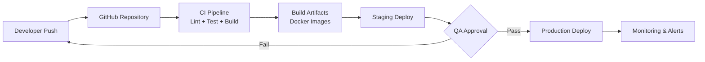

# 🚀 Deployment Guide — Smart Tourist Guide Morocco

## Environments

| Environment | Branch | URL (placeholder) | Purpose |
|---|---|---|---|
| Local | any | `http://localhost:8000` | Development |
| Staging | `develop` | `https://staging.smarttouristguide.ma` | QA / stakeholder review |
| Production | `main` | `https://smarttouristguide.ma` | Live platform |

---

## Deployment Diagram



---

## Prerequisites

- Docker & Docker Compose
- PHP 8.3+, Composer 2.x (for non-Docker deploys)
- Node.js 20+, npm/pnpm
- MySQL 8.0, Redis 7+
- A configured `.env` for both `backend/` and `frontend/`

---

## Backend Deployment (Laravel)

```bash
# 1. Pull latest code
git pull origin main

# 2. Install dependencies (production, no dev packages)
composer install --no-dev --optimize-autoloader

# 3. Copy and configure environment
cp .env.example .env
php artisan key:generate

# 4. Run migrations
php artisan migrate --force

# 5. Cache config, routes, views for performance
php artisan config:cache
php artisan route:cache
php artisan view:cache

# 6. Link storage
php artisan storage:link

# 7. Restart queue workers
php artisan queue:restart
```

## Frontend Deployment (React + Vite)

```bash
cd frontend

# Install dependencies
npm ci

# Build production bundle
npm run build

# Output in frontend/dist — deploy to CDN / static host
```

---

## Docker-Based Deployment (Recommended)

```bash
# Build and start all services
docker-compose up -d --build

# Run migrations inside the app container
docker-compose exec app php artisan migrate --force

# Tail logs
docker-compose logs -f app
```

Example `docker-compose.yml` services:
```yaml
services:
  app:
    build: ./backend
    ports: ["8000:8000"]
    depends_on: [mysql, redis]
  frontend:
    build: ./frontend
    ports: ["3000:3000"]
  mysql:
    image: mysql:8.0
    environment:
      MYSQL_DATABASE: smart_tourist_guide
  redis:
    image: redis:7-alpine
  queue:
    build: ./backend
    command: php artisan queue:work --tries=3
```

---

## CI/CD Pipeline (GitHub Actions — conceptual)

```yaml
name: CI/CD
on:
  push:
    branches: [develop, main]

jobs:
  test:
    runs-on: ubuntu-latest
    steps:
      - uses: actions/checkout@v4
      - name: Install PHP dependencies
        run: composer install
      - name: Run tests
        run: php artisan test
      - name: Install frontend dependencies
        run: cd frontend && npm ci
      - name: Run frontend build
        run: cd frontend && npm run build

  deploy:
    needs: test
    if: github.ref == 'refs/heads/main'
    runs-on: ubuntu-latest
    steps:
      - name: Deploy to production
        run: echo "Trigger deploy hook / SSH deploy script"
```

---

## Zero-Downtime Deployment Notes

- Use `php artisan down --render="errors::503"` only for breaking migrations; otherwise deploy without downtime via rolling container replacement.
- Run `php artisan migrate --force` **before** swapping traffic to the new container version when migrations are backward-compatible.
- Keep queue workers on a separate container so API deploys don't interrupt in-flight jobs.

---

## Rollback Procedure

1. Re-deploy the previous Docker image tag.
2. If a migration must be reverted: `php artisan migrate:rollback --step=1`.
3. Clear caches: `php artisan optimize:clear`.
4. Verify `/api/health` returns `200 OK`.

---

## Monitoring & Health Checks

| Check | Endpoint / Tool |
|---|---|
| API liveness | `GET /api/health` |
| Queue health | `php artisan queue:monitor` |
| Error tracking | Sentry (or equivalent) integration hook in `bootstrap/app.php` |
| Uptime | External uptime monitor (e.g. UptimeRobot) pinging `/api/health` every 60s |