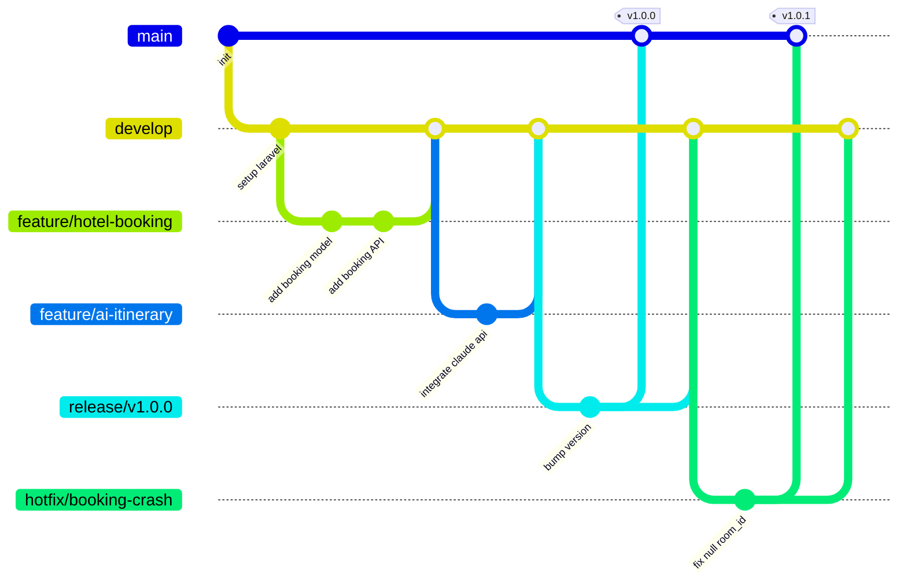

# 🌿 Git Workflow — Smart Tourist Guide Morocco

## Branching Strategy

We follow a **Git Flow**-inspired model:

| Branch | Purpose | Protected |
|---|---|---|
| `main` | Production-ready, deployable code | ✅ |
| `develop` | Integration branch for the next release | ✅ |
| `feature/*` | New features (`feature/hotel-booking-flow`) | ❌ |
| `bugfix/*` | Non-urgent bug fixes (`bugfix/room-price-rounding`) | ❌ |
| `hotfix/*` | Urgent production fixes (`hotfix/booking-crash`) | ❌ |
| `release/*` | Release stabilization (`release/v1.2.0`) | ❌ |



---

## Branch Naming Convention

```
<type>/<short-description>
```

| Type | Example |
|---|---|
| `feature/` | `feature/transport-booking-api` |
| `bugfix/` | `bugfix/review-rating-validation` |
| `hotfix/` | `hotfix/production-500-error` |
| `chore/` | `chore/update-dependencies` |
| `docs/` | `docs/api-documentation` |

---

## Commit Message Convention

We follow **Conventional Commits**:

```
<type>(<scope>): <short summary>

[optional body]

[optional footer]
```

| Type | Use case |
|---|---|
| `feat` | New feature |
| `fix` | Bug fix |
| `docs` | Documentation only |
| `style` | Formatting, no logic change |
| `refactor` | Code change without feature/fix |
| `test` | Adding/updating tests |
| `chore` | Tooling, build config, dependencies |

**Examples:**
```
feat(hotel-booking): add availability check before creating booking
fix(reviews): prevent duplicate reviews per booking
docs(api): document AI itinerary endpoint
refactor(auth): extract token issuance into AuthService
```

---

## Pull Request Process

1. Branch off `develop` (or `main` for hotfixes).
2. Commit using Conventional Commits.
3. Push and open a PR targeting `develop`.
4. PR must include:
   - Clear description of the change
   - Linked issue/ticket number
   - Screenshots (for UI changes)
   - Checklist confirming tests pass
5. At least **1 approval** required before merge.
6. Squash-merge into `develop` to keep history clean.
7. Delete the feature branch after merge.

---

## Release Process

1. Cut a `release/x.y.z` branch from `develop`.
2. Freeze new features; only bug fixes allowed.
3. QA sign-off on staging.
4. Merge `release/x.y.z` into `main` and tag (`vX.Y.Z`).
5. Merge `main` back into `develop` to sync.
6. Deploy `main` to production (see `docs/deployment.md`).

---

## Code Review Checklist

- [ ] Follows `docs/coding-standards.md`
- [ ] No hardcoded secrets/credentials
- [ ] Adequate test coverage for new logic
- [ ] No N+1 queries introduced (checked via Laravel Debugbar/Telescope)
- [ ] API changes reflected in `docs/api.md`
- [ ] Database changes include a migration + rollback (`down()`)