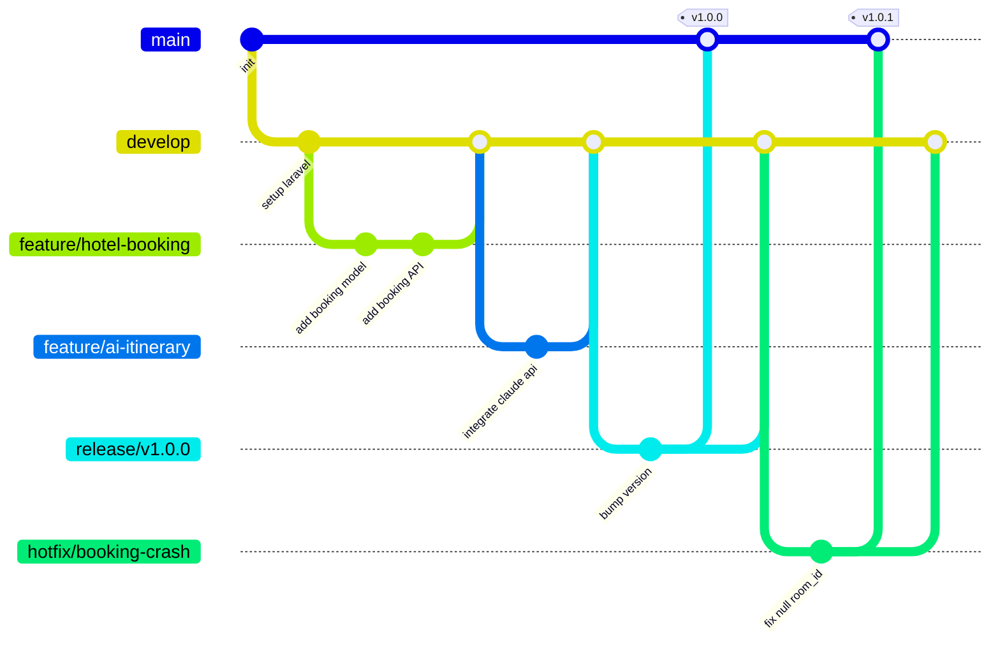
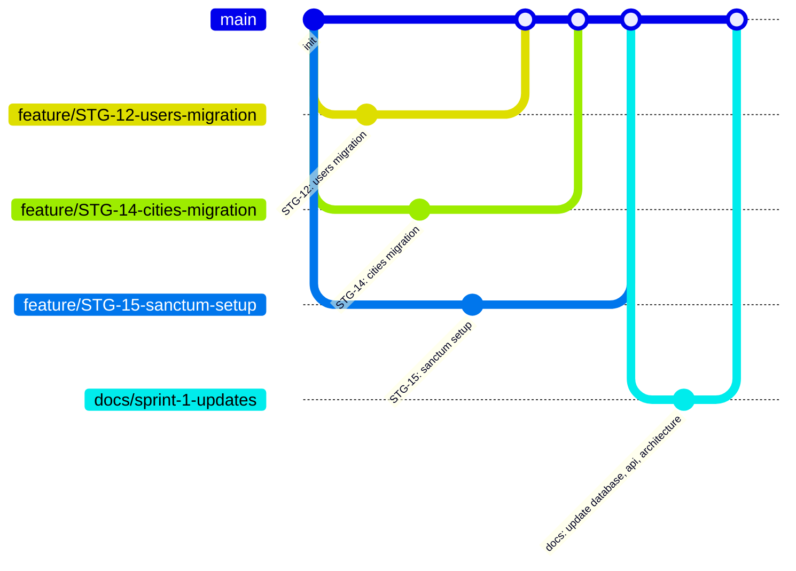

# 🌿 Git Workflow — Smart Tourist Guide Morocco

## Branching Strategy

We follow a **Git Flow**-inspired model:

| Branch | Purpose | Protected |
|---|---|---|
| `main` | Production-ready, deployable code | ✅ |
| `develop` | Integration branch for the next release | ✅ |
| `feature/*` | New features (`feature/hotel-booking-flow`) | ❌ |
| `bugfix/*` | Non-urgent bug fixes (`bugfix/room-price-rounding`) | ❌ |
| `hotfix/*` | Urgent production fixes (`hotfix/booking-crash`) | ❌ |
| `release/*` | Release stabilization (`release/v1.2.0`) | ❌ |



---

## Branch Naming Convention

```
<type>/<short-description>
```

| Type | Example |
|---|---|
| `feature/` | `feature/transport-booking-api` |
| `bugfix/` | `bugfix/review-rating-validation` |
| `hotfix/` | `hotfix/production-500-error` |
| `chore/` | `chore/update-dependencies` |
| `docs/` | `docs/api-documentation` |

---

## Commit Message Convention

We follow **Conventional Commits**:

```
<type>(<scope>): <short summary>

[optional body]

[optional footer]
```

| Type | Use case |
|---|---|
| `feat` | New feature |
| `fix` | Bug fix |
| `docs` | Documentation only |
| `style` | Formatting, no logic change |
| `refactor` | Code change without feature/fix |
| `test` | Adding/updating tests |
| `chore` | Tooling, build config, dependencies |

**Examples:**
```
feat(hotel-booking): add availability check before creating booking
fix(reviews): prevent duplicate reviews per booking
docs(api): document AI itinerary endpoint
refactor(auth): extract token issuance into AuthService
```

---

## Pull Request Process

1. Branch off `develop` (or `main` for hotfixes).
2. Commit using Conventional Commits.
3. Push and open a PR targeting `develop`.
4. PR must include:
   - Clear description of the change
   - Linked issue/ticket number
   - Screenshots (for UI changes)
   - Checklist confirming tests pass
5. At least **1 approval** required before merge.
6. Squash-merge into `develop` to keep history clean.
7. Delete the feature branch after merge.

---

## Release Process

1. Cut a `release/x.y.z` branch from `develop`.
2. Freeze new features; only bug fixes allowed.
3. QA sign-off on staging.
4. Merge `release/x.y.z` into `main` and tag (`vX.Y.Z`).
5. Merge `main` back into `develop` to sync.
6. Deploy `main` to production (see `docs/deployment.md`).

---

## Code Review Checklist

- [ ] Follows `docs/coding-standards.md`
- [ ] No hardcoded secrets/credentials
- [ ] Adequate test coverage for new logic
- [ ] No N+1 queries introduced (checked via Laravel Debugbar/Telescope)
- [ ] API changes reflected in `docs/api.md`
- [ ] Database changes include a migration + rollback (`down()`)

---

## Sprint 1 — Task Branches

Each Jira task gets its own feature branch from `main`. Branches use the naming convention `feature/STG-XX-short-description`.

### Branch List

| Branch | Jira | Task | Status |
|--------|------|------|--------|
| `feature/STG-12-users-migration` | STG-12 | Users Migration & Model | Committed |
| `feature/STG-14-cities-migration` | STG-14 | Cities Migration & Model | Committed |
| `feature/STG-15-sanctum-setup` | STG-15 | Install & Configure Laravel Sanctum | Committed |
| `feature/STG-16-api-routes` | STG-16 | Create API Routes File | Committed |
| `feature/STG-17-php-enums` | STG-17 | Create PHP Enums | Committed |
| `feature/STG-19-env-example` | STG-19 | Create .env.example | Committed |
| `feature/STG-20-attractions-migration` | STG-20 | Attractions Migration & Model | Pending |
| `feature/STG-21-hotels-migration` | STG-21 | Hotels Migration & Model | Pending |
| `feature/STG-22-rooms-migration` | STG-22 | Rooms Migration & Model | Pending |
| `feature/STG-23-drivers-migration` | STG-23 | Drivers Migration & Model | Pending |
| `feature/STG-24-vehicles-migration` | STG-24 | Vehicles Migration & Model | Pending |
| `feature/STG-27-reviews-migration` | STG-27 | Reviews Migration & Model | Pending |
| `feature/STG-28-favorites-migration` | STG-28 | Favorites Migration & Model | Pending |
| `feature/STG-29-auth-controller` | STG-29 | AuthController (Register, Login, Logout, Me) | Pending |
| `feature/STG-30-rbac-middleware` | STG-30 | RBAC Middleware | Pending |
| `feature/STG-31-user-controller` | STG-31 | UserController (Admin CRUD) | Pending |
| `feature/STG-33-city-controller` | STG-33 | CityController (CRUD + Search) | Pending |
| `feature/STG-72-restaurants-migration` | STG-72 | Restaurants Migration & Model | Pending |
| `docs/sprint-1-updates` | — | Documentation (database.md, api.md, Architecture.md) | Pending |

### Removed Tasks (No Branch Created)

| Jira | Task | Reason |
|------|------|--------|
| STG-13 | Roles Migration | Role is ENUM on users table |
| STG-18 | Morph Map Config | No polymorphic relationships |
| STG-25 | Reviews Migration (old) | Replaced by STG-27 with explicit FKs |
| STG-26 | Favorites Migration (old) | Replaced by STG-28 with explicit FKs |
| STG-32 | BookingController (old) | Replaced by unified bookings table |

### Workflow



### Execution Commands

```bash
# Phase 1: Cleanup old combined branch
git stash
git checkout main
git branch -D feature/sprint-1

# Phase 2: Create branches with commits (cherry-pick)
git checkout main
git checkout -b feature/STG-12-users-migration
git cherry-pick 37b0607

git checkout main
git checkout -b feature/STG-14-cities-migration
git cherry-pick 1f7b668

git checkout main
git checkout -b feature/STG-15-sanctum-setup
git cherry-pick 21ba200

git checkout main
git checkout -b feature/STG-16-api-routes
git cherry-pick 95dfa89

git checkout main
git checkout -b feature/STG-17-php-enums
git cherry-pick ff0ab7d

git checkout main
git checkout -b feature/STG-19-env-example
git cherry-pick c3b9080

# Phase 3: Create empty branches for pending tasks
git checkout main
git checkout -b feature/STG-20-attractions-migration
git commit --allow-empty -m "chore(STG-20): initialize branch for attractions migration"

git checkout main
git checkout -b feature/STG-21-hotels-migration
git commit --allow-empty -m "chore(STG-21): initialize branch for hotels migration"

git checkout main
git checkout -b feature/STG-22-rooms-migration
git commit --allow-empty -m "chore(STG-22): initialize branch for rooms migration"

git checkout main
git checkout -b feature/STG-23-drivers-migration
git commit --allow-empty -m "chore(STG-23): initialize branch for drivers migration"

git checkout main
git checkout -b feature/STG-24-vehicles-migration
git commit --allow-empty -m "chore(STG-24): initialize branch for vehicles migration"

git checkout main
git checkout -b feature/STG-27-reviews-migration
git commit --allow-empty -m "chore(STG-27): initialize branch for reviews migration"

git checkout main
git checkout -b feature/STG-28-favorites-migration
git commit --allow-empty -m "chore(STG-28): initialize branch for favorites migration"

git checkout main
git checkout -b feature/STG-29-auth-controller
git commit --allow-empty -m "chore(STG-29): initialize branch for auth controller"

git checkout main
git checkout -b feature/STG-30-rbac-middleware
git commit --allow-empty -m "chore(STG-30): initialize branch for RBAC middleware"

git checkout main
git checkout -b feature/STG-31-user-controller
git commit --allow-empty -m "chore(STG-31): initialize branch for user controller"

git checkout main
git checkout -b feature/STG-33-city-controller
git commit --allow-empty -m "chore(STG-33): initialize branch for city controller"

git checkout main
git checkout -b feature/STG-72-restaurants-migration
git commit --allow-empty -m "chore(STG-72): initialize branch for restaurants migration"

# Phase 4: Documentation branch
git checkout main
git checkout -b docs/sprint-1-updates
git stash pop
git add docs/ docs/database.md docs/api.md docs/Architecture.md "Database Design/"
git commit -m "docs: update database, api, architecture per MLD design"

# Phase 5: Cleanup
git checkout main
```