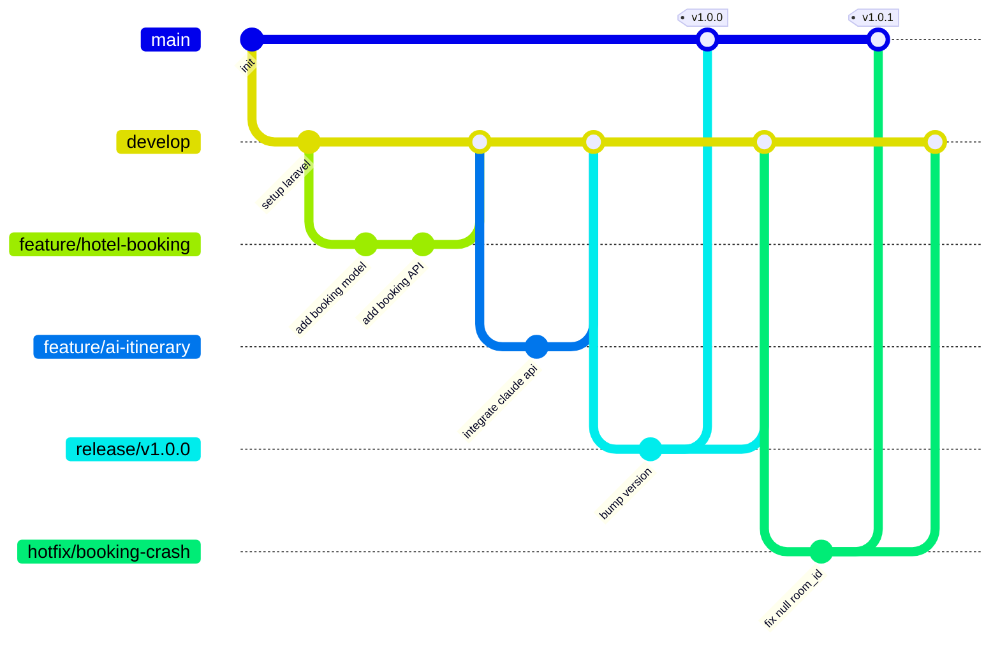
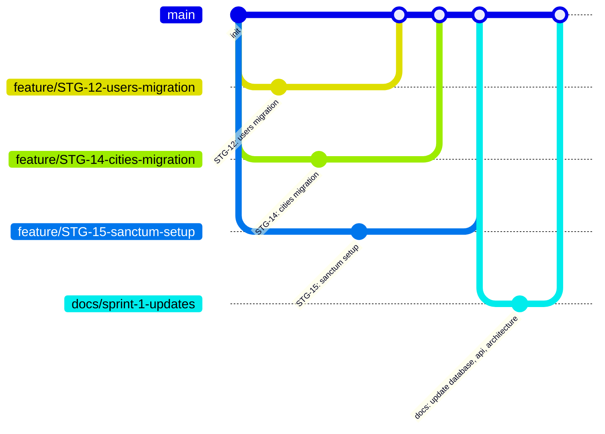
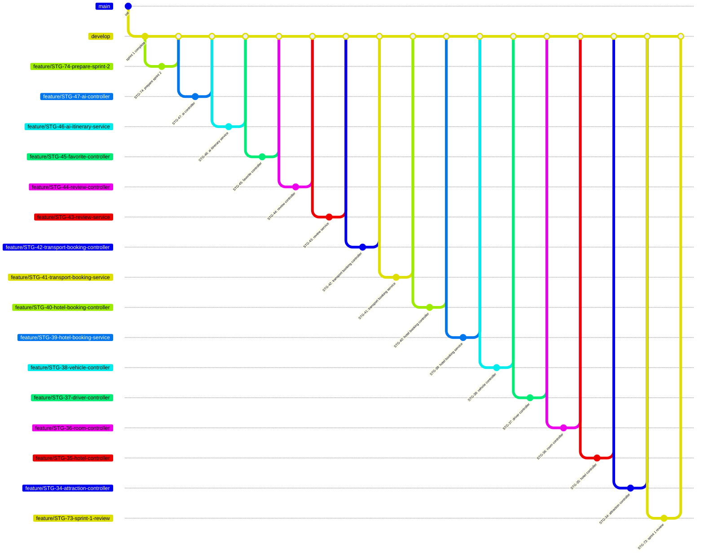
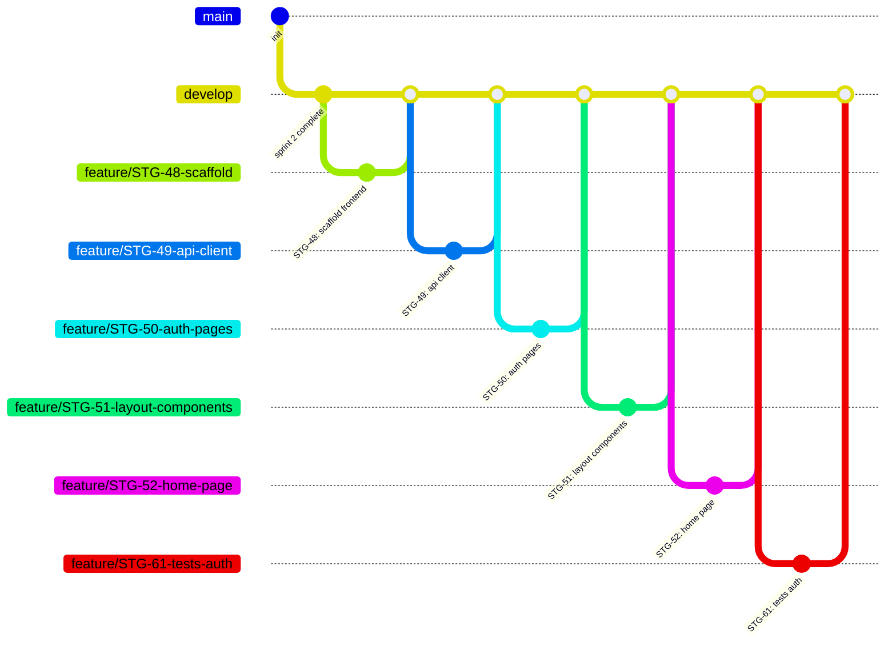

# 🌿 Git Workflow — Smart Tourist Guide Morocco

## Branching Strategy

We follow a **Git Flow**-inspired model:

| Branch | Purpose | Protected |
|---|---|---|
| `main` | Production-ready, deployable code | ✅ |
| `develop` | Integration branch for the next release | ✅ |
| `feature/*` | New features (`feature/hotel-booking-flow`) | ❌ |
| `bugfix/*` | Non-urgent bug fixes (`bugfix/room-price-rounding`) | ❌ |
| `hotfix/*` | Urgent production fixes (`hotfix/booking-crash`) | ❌ |
| `release/*` | Release stabilization (`release/v1.2.0`) | ❌ |


```mermaid
gitGraph
    commit id: "init"
    branch develop
    checkout develop
    commit id: "setup laravel"
    branch feature/hotel-booking
    checkout feature/hotel-booking
    commit id: "add booking model"
    commit id: "add booking API"
    checkout develop
    merge feature/hotel-booking
    branch feature/ai-itinerary
    checkout feature/ai-itinerary
    commit id: "integrate claude api"
    checkout develop
    merge feature/ai-itinerary
    branch release/v1.0.0
    checkout release/v1.0.0
    commit id: "bump version"
    checkout main
    merge release/v1.0.0 tag: "v1.0.0"
    checkout develop
    merge release/v1.0.0
    branch hotfix/booking-crash
    checkout hotfix/booking-crash
    commit id: "fix null room_id"
    checkout main
    merge hotfix/booking-crash tag: "v1.0.1"
    checkout develop
    merge hotfix/booking-crash
```

---

## Branch Naming Convention

```
<type>/<short-description>
```

| Type | Example |
|---|---|
| `feature/` | `feature/transport-booking-api` |
| `bugfix/` | `bugfix/review-rating-validation` |
| `hotfix/` | `hotfix/production-500-error` |
| `chore/` | `chore/update-dependencies` |
| `docs/` | `docs/api-documentation` |

---

## Commit Message Convention

We follow **Conventional Commits**:

```
<type>(<scope>): <short summary>

[optional body]

[optional footer]
```

| Type | Use case |
|---|---|
| `feat` | New feature |
| `fix` | Bug fix |
| `docs` | Documentation only |
| `style` | Formatting, no logic change |
| `refactor` | Code change without feature/fix |
| `test` | Adding/updating tests |
| `chore` | Tooling, build config, dependencies |

**Examples:**
```
feat(hotel-booking): add availability check before creating booking
fix(reviews): prevent duplicate reviews per booking
docs(api): document AI itinerary endpoint
refactor(auth): extract token issuance into AuthService
```

---

## Pull Request Process

1. Branch off `develop` (or `main` for hotfixes).
2. Commit using Conventional Commits.
3. Push and open a PR targeting `develop`.
4. PR must include:
   - Clear description of the change
   - Linked issue/ticket number
   - Screenshots (for UI changes)
   - Checklist confirming tests pass
5. At least **1 approval** required before merge.
6. Squash-merge into `develop` to keep history clean.
7. Delete the feature branch after merge.

---

## Release Process

1. Cut a `release/x.y.z` branch from `develop`.
2. Freeze new features; only bug fixes allowed.
3. QA sign-off on staging.
4. Merge `release/x.y.z` into `main` and tag (`vX.Y.Z`).
5. Merge `main` back into `develop` to sync.
6. Deploy `main` to production (see `docs/deployment.md`).

---

## Code Review Checklist

- [ ] Follows `docs/coding-standards.md`
- [ ] No hardcoded secrets/credentials
- [ ] Adequate test coverage for new logic
- [ ] No N+1 queries introduced (checked via Laravel Debugbar/Telescope)
- [ ] API changes reflected in `docs/api.md`
- [ ] Database changes include a migration + rollback (`down()`)

---

## Sprint 1 — Task Branches

Each Jira task gets its own feature branch from `main`. Branches use the naming convention `feature/STG-XX-short-description`.

### Branch List

| Branch | Jira | Task | Status |
|--------|------|------|--------|
| `feature/STG-12-users-migration` | STG-12 | Users Migration & Model | Committed |
| `feature/STG-14-cities-migration` | STG-14 | Cities Migration & Model | Committed |
| `feature/STG-15-sanctum-setup` | STG-15 | Install & Configure Laravel Sanctum | Committed |
| `feature/STG-16-api-routes` | STG-16 | Create API Routes File | Committed |
| `feature/STG-17-php-enums` | STG-17 | Create PHP Enums | Committed |
| `feature/STG-19-env-example` | STG-19 | Create .env.example | Committed |
| `feature/STG-20-attractions-migration` | STG-20 | Attractions Migration & Model | Pending |
| `feature/STG-21-hotels-migration` | STG-21 | Hotels Migration & Model | Pending |
| `feature/STG-22-rooms-migration` | STG-22 | Rooms Migration & Model | Pending |
| `feature/STG-23-drivers-migration` | STG-23 | Drivers Migration & Model | Pending |
| `feature/STG-24-vehicles-migration` | STG-24 | Vehicles Migration & Model | Pending |
| `feature/STG-27-reviews-migration` | STG-27 | Reviews Migration & Model | Pending |
| `feature/STG-28-favorites-migration` | STG-28 | Favorites Migration & Model | Pending |
| `feature/STG-29-auth-controller` | STG-29 | AuthController (Register, Login, Logout, Me) | Pending |
| `feature/STG-30-rbac-middleware` | STG-30 | RBAC Middleware | Pending |
| `feature/STG-31-user-controller` | STG-31 | UserController (Admin CRUD) | Pending |
| `feature/STG-33-city-controller` | STG-33 | CityController (CRUD + Search) | Pending |
| `feature/STG-72-restaurants-migration` | STG-72 | Restaurants Migration & Model | Pending |
| `docs/sprint-1-updates` | — | Documentation (database.md, api.md, Architecture.md) | Pending |

### Removed Tasks (No Branch Created)

| Jira | Task | Reason |
|------|------|--------|
| STG-13 | Roles Migration | Role is ENUM on users table |
| STG-18 | Morph Map Config | No polymorphic relationships |
| STG-25 | Reviews Migration (old) | Replaced by STG-27 with explicit FKs |
| STG-26 | Favorites Migration (old) | Replaced by STG-28 with explicit FKs |
| STG-32 | BookingController (old) | Replaced by unified bookings table |

### Workflow


```mermaid
gitGraph
    commit id: "init"
    branch feature/STG-12-users-migration
    checkout feature/STG-12-users-migration
    commit id: "STG-12: users migration"
    checkout main
    branch feature/STG-14-cities-migration
    checkout feature/STG-14-cities-migration
    commit id: "STG-14: cities migration"
    checkout main
    branch feature/STG-15-sanctum-setup
    checkout feature/STG-15-sanctum-setup
    commit id: "STG-15: sanctum setup"
    checkout main
    merge feature/STG-12-users-migration
    merge feature/STG-14-cities-migration
    merge feature/STG-15-sanctum-setup
    branch docs/sprint-1-updates
    checkout docs/sprint-1-updates
    commit id: "docs: update database, api, architecture"
    checkout main
    merge docs/sprint-1-updates
```

### Execution Commands

```bash
# Phase 1: Cleanup old combined branch
git stash
git checkout main
git branch -D feature/sprint-1

# Phase 2: Create branches with commits (cherry-pick)
git checkout main
git checkout -b feature/STG-12-users-migration
git cherry-pick 37b0607

git checkout main
git checkout -b feature/STG-14-cities-migration
git cherry-pick 1f7b668

git checkout main
git checkout -b feature/STG-15-sanctum-setup
git cherry-pick 21ba200

git checkout main
git checkout -b feature/STG-16-api-routes
git cherry-pick 95dfa89

git checkout main
git checkout -b feature/STG-17-php-enums
git cherry-pick ff0ab7d

git checkout main
git checkout -b feature/STG-19-env-example
git cherry-pick c3b9080

# Phase 3: Create empty branches for pending tasks
git checkout main
git checkout -b feature/STG-20-attractions-migration
git commit --allow-empty -m "chore(STG-20): initialize branch for attractions migration"

git checkout main
git checkout -b feature/STG-21-hotels-migration
git commit --allow-empty -m "chore(STG-21): initialize branch for hotels migration"

git checkout main
git checkout -b feature/STG-22-rooms-migration
git commit --allow-empty -m "chore(STG-22): initialize branch for rooms migration"

git checkout main
git checkout -b feature/STG-23-drivers-migration
git commit --allow-empty -m "chore(STG-23): initialize branch for drivers migration"

git checkout main
git checkout -b feature/STG-24-vehicles-migration
git commit --allow-empty -m "chore(STG-24): initialize branch for vehicles migration"

git checkout main
git checkout -b feature/STG-27-reviews-migration
git commit --allow-empty -m "chore(STG-27): initialize branch for reviews migration"

git checkout main
git checkout -b feature/STG-28-favorites-migration
git commit --allow-empty -m "chore(STG-28): initialize branch for favorites migration"

git checkout main
git checkout -b feature/STG-29-auth-controller
git commit --allow-empty -m "chore(STG-29): initialize branch for auth controller"

git checkout main
git checkout -b feature/STG-30-rbac-middleware
git commit --allow-empty -m "chore(STG-30): initialize branch for RBAC middleware"

git checkout main
git checkout -b feature/STG-31-user-controller
git commit --allow-empty -m "chore(STG-31): initialize branch for user controller"

git checkout main
git checkout -b feature/STG-33-city-controller
git commit --allow-empty -m "chore(STG-33): initialize branch for city controller"

git checkout main
git checkout -b feature/STG-72-restaurants-migration
git commit --allow-empty -m "chore(STG-72): initialize branch for restaurants migration"

# Phase 4: Documentation branch
git checkout main
git checkout -b docs/sprint-1-updates
git stash pop
git add docs/ docs/database.md docs/api.md docs/Architecture.md "Database Design/"
git commit -m "docs: update database, api, architecture per MLD design"

# Phase 5: Cleanup
git checkout main
```

---

## Sprint 2 — Task Branches

Each Jira task gets its own feature branch from `develop`. Branches use the naming convention `feature/STG-XX-short-description`.

### Branch List

| Branch | Jira | Task | Status | Commit |
|--------|------|------|--------|--------|
| `feature/STG-74-prepare-sprint-2` | STG-74 | Create a branch named feature/prepare-sprint-2 | In Progress  | `chore(STG-74): initialize branch for sprint 2 preparation` |
| `feature/STG-73-sprint-1-review` | STG-73 | Check Sprint 1 tasks & create LinkedIn post | To Do | `chore(STG-73): initialize branch for sprint 1 review` |
| `feature/STG-47-ai-controller` | STG-47 | Backend: AiController | To Do | `feat(ai): initialize AiController for itinerary generation` |
| `feature/STG-46-ai-itinerary-service` | STG-46 | Backend: AiItineraryService (Claude API Integration) | To Do | `feat(ai): initialize AiItineraryService with Claude API` |
| `feature/STG-45-favorite-controller` | STG-45 | Backend: FavoriteController | To Do | `feat(favorites): initialize FavoriteController for CRUD operations` |
| `feature/STG-44-review-controller` | STG-44 | Backend: ReviewController | To Do | `feat(reviews): initialize ReviewController for rating management` |
| `feature/STG-43-review-service` | STG-43 | Backend: ReviewService + RatingCalculator | To Do | `feat(reviews): initialize ReviewService with rating calculation` |
| `feature/STG-42-transport-booking-controller` | STG-42 | Backend: TransportBookingController | To Do | `feat(transport): initialize TransportBookingController` |
| `feature/STG-41-transport-booking-service` | STG-41 | Backend: TransportBookingService (Business Logic) | To Do | `feat(transport): initialize TransportBookingService` |
| `feature/STG-40-hotel-booking-controller` | STG-40 | Backend: HotelBookingController | To Do | `feat(hotel-booking): initialize HotelBookingController` |
| `feature/STG-39-hotel-booking-service` | STG-39 | Backend: HotelBookingService (Business Logic) | To Do | `feat(hotel-booking): initialize HotelBookingService` |
| `feature/STG-38-vehicle-controller` | STG-38 | Backend: VehicleController (CRUD under Driver) | To Do | `feat(vehicles): initialize VehicleController for driver vehicles` |
| `feature/STG-37-driver-controller` | STG-37 | Backend: DriverController (CRUD + Verification) | To Do | `feat(drivers): initialize DriverController with verification` |
| `feature/STG-36-room-controller` | STG-36 | Backend: RoomController (CRUD under Hotel) | To Do | `feat(rooms): initialize RoomController for hotel rooms` |
| `feature/STG-35-hotel-controller` | STG-35 | Backend: HotelController (CRUD + Search) | To Do | `feat(hotels): initialize HotelController with search` |
| `feature/STG-34-attraction-controller` | STG-34 | Backend: AttractionController (CRUD + Search + Filter) | To Do | `feat(attractions): initialize AttractionController with filters` |

### Workflow


```mermaid
gitGraph
    commit id: "init"
    branch develop
    checkout develop
    commit id: "sprint 1 complete"
    branch feature/STG-74-prepare-sprint-2
    checkout feature/STG-74-prepare-sprint-2
    commit id: "STG-74: prepare sprint 2"
    checkout develop
    merge feature/STG-74-prepare-sprint-2
    branch feature/STG-47-ai-controller
    checkout feature/STG-47-ai-controller
    commit id: "STG-47: ai controller"
    checkout develop
    merge feature/STG-47-ai-controller
    branch feature/STG-46-ai-itinerary-service
    checkout feature/STG-46-ai-itinerary-service
    commit id: "STG-46: ai itinerary service"
    checkout develop
    merge feature/STG-46-ai-itinerary-service
    branch feature/STG-45-favorite-controller
    checkout feature/STG-45-favorite-controller
    commit id: "STG-45: favorite controller"
    checkout develop
    merge feature/STG-45-favorite-controller
    branch feature/STG-44-review-controller
    checkout feature/STG-44-review-controller
    commit id: "STG-44: review controller"
    checkout develop
    merge feature/STG-44-review-controller
    branch feature/STG-43-review-service
    checkout feature/STG-43-review-service
    commit id: "STG-43: review service"
    checkout develop
    merge feature/STG-43-review-service
    branch feature/STG-42-transport-booking-controller
    checkout feature/STG-42-transport-booking-controller
    commit id: "STG-42: transport booking controller"
    checkout develop
    merge feature/STG-42-transport-booking-controller
    branch feature/STG-41-transport-booking-service
    checkout feature/STG-41-transport-booking-service
    commit id: "STG-41: transport booking service"
    checkout develop
    merge feature/STG-41-transport-booking-service
    branch feature/STG-40-hotel-booking-controller
    checkout feature/STG-40-hotel-booking-controller
    commit id: "STG-40: hotel booking controller"
    checkout develop
    merge feature/STG-40-hotel-booking-controller
    branch feature/STG-39-hotel-booking-service
    checkout feature/STG-39-hotel-booking-service
    commit id: "STG-39: hotel booking service"
    checkout develop
    merge feature/STG-39-hotel-booking-service
    branch feature/STG-38-vehicle-controller
    checkout feature/STG-38-vehicle-controller
    commit id: "STG-38: vehicle controller"
    checkout develop
    merge feature/STG-38-vehicle-controller
    branch feature/STG-37-driver-controller
    checkout feature/STG-37-driver-controller
    commit id: "STG-37: driver controller"
    checkout develop
    merge feature/STG-37-driver-controller
    branch feature/STG-36-room-controller
    checkout feature/STG-36-room-controller
    commit id: "STG-36: room controller"
    checkout develop
    merge feature/STG-36-room-controller
    branch feature/STG-35-hotel-controller
    checkout feature/STG-35-hotel-controller
    commit id: "STG-35: hotel controller"
    checkout develop
    merge feature/STG-35-hotel-controller
    branch feature/STG-34-attraction-controller
    checkout feature/STG-34-attraction-controller
    commit id: "STG-34: attraction controller"
    checkout develop
    merge feature/STG-34-attraction-controller
    branch feature/STG-73-sprint-1-review
    checkout feature/STG-73-sprint-1-review
    commit id: "STG-73: sprint 1 review"
    checkout develop
    merge feature/STG-73-sprint-1-review
```

### Execution Commands

```bash
# Phase 1: Ensure develop is up to date
git checkout develop
git pull origin develop

# Phase 2: Create branches for completed tasks (with actual commits)
git checkout develop
git checkout -b feature/STG-74-prepare-sprint-2
git commit --allow-empty -m "chore(STG-74): initialize branch for sprint 2 preparation"

# Phase 3: Create branches for To Do tasks (empty initialization commits)
git checkout develop
git checkout -b feature/STG-73-sprint-1-review
git commit --allow-empty -m "chore(STG-73): initialize branch for sprint 1 review"

git checkout develop
git checkout -b feature/STG-47-ai-controller
git commit --allow-empty -m "feat(ai): initialize AiController for itinerary generation"

git checkout develop
git checkout -b feature/STG-46-ai-itinerary-service
git commit --allow-empty -m "feat(ai): initialize AiItineraryService with Claude API"

git checkout develop
git checkout -b feature/STG-45-favorite-controller
git commit --allow-empty -m "feat(favorites): initialize FavoriteController for CRUD operations"

git checkout develop
git checkout -b feature/STG-44-review-controller
git commit --allow-empty -m "feat(reviews): initialize ReviewController for rating management"

git checkout develop
git checkout -b feature/STG-43-review-service
git commit --allow-empty -m "feat(reviews): initialize ReviewService with rating calculation"

git checkout develop
git checkout -b feature/STG-42-transport-booking-controller
git commit --allow-empty -m "feat(transport): initialize TransportBookingController"

git checkout develop
git checkout -b feature/STG-41-transport-booking-service
git commit --allow-empty -m "feat(transport): initialize TransportBookingService"

git checkout develop
git checkout -b feature/STG-40-hotel-booking-controller
git commit --allow-empty -m "feat(hotel-booking): initialize HotelBookingController"

git checkout develop
git checkout -b feature/STG-39-hotel-booking-service
git commit --allow-empty -m "feat(hotel-booking): initialize HotelBookingService"

git checkout develop
git checkout -b feature/STG-38-vehicle-controller
git commit --allow-empty -m "feat(vehicles): initialize VehicleController for driver vehicles"

git checkout develop
git checkout -b feature/STG-37-driver-controller
git commit --allow-empty -m "feat(drivers): initialize DriverController with verification"

git checkout develop
git checkout -b feature/STG-36-room-controller
git commit --allow-empty -m "feat(rooms): initialize RoomController for hotel rooms"

git checkout develop
git checkout -b feature/STG-35-hotel-controller
git commit --allow-empty -m "feat(hotels): initialize HotelController with search"

git checkout develop
git checkout -b feature/STG-34-attraction-controller
git commit --allow-empty -m "feat(attractions): initialize AttractionController with filters"

# Phase 4: Return to develop
git checkout develop
```

---

## Sprint 3 — Task Branches

Each Jira task gets its own feature branch from `develop`. Branches use the naming convention `feature/STG-XX-short-description`.

### Branch List

#### Backend — Foundation (Done)

| Branch | Jira | Task | Commit Message |
|--------|------|------|----------------|
| `feature/STG-12-users-migration` | STG-12 | Rewrite Users Migration & Model per MLD Schema | `feat(users): rewrite migration and model per MLD schema` |
| `feature/STG-14-cities-migration` | STG-14 | Create Cities Migration, Model & Seeder per MLD | `feat(cities): create migration, model and seeder` |
| `feature/STG-15-sanctum-setup` | STG-15 | Install & Configure Laravel Sanctum | `feat(auth): install and configure Laravel Sanctum` |
| `feature/STG-16-api-routes` | STG-16 | Create API Routes File | `feat(routes): create versioned api routes with v1 prefix` |
| `feature/STG-17-php-enums` | STG-17 | Create PHP Enums (Role, UserStatus, BookingStatus, BookingType) | `feat(enums): create Role, UserStatus, BookingStatus, BookingType enums` |
| `feature/STG-19-env-example` | STG-19 | Create .env.example for Backend | `chore(env): create .env.example with all required variables` |
| `feature/STG-20-attractions-migration` | STG-20 | Attractions Migration & Model per MLD | `feat(attractions): create migration and model per MLD` |
| `feature/STG-21-hotels-migration` | STG-21 | Hotels Migration & Model per MLD | `feat(hotels): create migration and model per MLD` |
| `feature/STG-22-rooms-migration` | STG-22 | Rooms Migration & Model per MLD | `feat(rooms): create migration and model per MLD` |
| `feature/STG-23-drivers-migration` | STG-23 | Drivers Migration & Model per MLD | `feat(drivers): create migration and model per MLD` |
| `feature/STG-24-vehicles-migration` | STG-24 | Vehicles Migration & Model per MLD | `feat(vehicles): create migration and model per MLD` |
| `feature/STG-27-reviews-migration` | STG-27 | Reviews Migration & Model per MLD (explicit FKs) | `feat(reviews): create migration and model with explicit FKs` |
| `feature/STG-28-favorites-migration` | STG-28 | Favorites Migration & Model per MLD (explicit FKs) | `feat(favorites): create migration and model with explicit FKs` |
| `feature/STG-29-auth-controller` | STG-29 | AuthController (Register, Login, Logout, Me) | `feat(auth): implement AuthController with register, login, logout, me` |
| `feature/STG-30-rbac-middleware` | STG-30 | RBAC Middleware | `feat(middleware): update EnsureRoleIs to use ENUM role values` |
| `feature/STG-31-user-controller` | STG-31 | UserController (Admin CRUD) | `feat(users): implement UserController with profile and admin CRUD` |
| `feature/STG-72-restaurants-migration` | STG-72 | Restaurants Migration & Model per MLD | `feat(restaurants): create migration and model per MLD` |

#### Backend — Catalog Controllers (Done)

| Branch | Jira | Task | Commit Message |
|--------|------|------|----------------|
| `feature/STG-33-city-controller` | STG-33 | CityController (CRUD + Search) | `feat(cities): implement CityController with CRUD` |
| `feature/STG-34-attraction-controller` | STG-34 | AttractionController (CRUD + Search + Filter) | `feat(attractions): implement AttractionController with CRUD` |
| `feature/STG-35-hotel-controller` | STG-35 | HotelController (CRUD + Search) | `feat(hotels): implement HotelController with CRUD` |
| `feature/STG-36-room-controller` | STG-36 | RoomController (CRUD under Hotel) | `feat(rooms): implement RoomController nested under hotels` |
| `feature/STG-37-driver-controller` | STG-37 | DriverController (CRUD + Verification) | `feat(drivers): implement DriverController with CRUD` |
| `feature/STG-38-vehicle-controller` | STG-38 | VehicleController (CRUD under Driver) | `feat(vehicles): implement VehicleController nested under drivers` |
| `feature/STG-47-restaurants-controller` | STG-47 | RestaurantController (CRUD) | `feat(restaurants): implement RestaurantController with CRUD` |

#### Backend — Booking Engine (Done)

| Branch | Jira | Task | Commit Message |
|--------|------|------|----------------|
| `feature/STG-39-hotel-booking-service` | STG-39 | HotelBookingService (Business Logic) | `feat(bookings): implement HotelBookingService business logic` |
| `feature/STG-40-hotel-booking-controller` | STG-40 | HotelBookingController | `feat(bookings): implement HotelBookingController with CRUD` |
| `feature/STG-41-transport-booking-service` | STG-41 | TransportBookingService (Business Logic) | `feat(bookings): implement TransportBookingService business logic` |
| `feature/STG-42-transport-booking-controller` | STG-42 | TransportBookingController | `feat(bookings): implement TransportBookingController with CRUD` |

#### Backend — Reviews & Favorites (Done)

| Branch | Jira | Task | Commit Message |
|--------|------|------|----------------|
| `feature/STG-43-review-service` | STG-43 | ReviewService + RatingCalculator | `feat(reviews): implement ReviewService and RatingCalculator` |
| `feature/STG-44-review-controller` | STG-44 | ReviewController | `feat(reviews): implement ReviewController with CRUD` |
| `feature/STG-45-favorite-controller` | STG-45 | FavoriteController (Toggle) | `feat(favorites): implement FavoriteController with toggle` |

#### Backend — Testing (To Do)

| Branch | Jira | Task | Commit Message |
|--------|------|------|----------------|
| `feature/STG-61-tests-auth` | STG-61 | Feature Tests — Auth Endpoints | `test(auth): add feature tests for auth endpoints` |
| `feature/STG-62-tests-catalog` | STG-62 | Feature Tests — Catalog CRUD | `test(catalog): add feature tests for catalog CRUD endpoints` |
| `feature/STG-63-tests-bookings` | STG-63 | Feature Tests — Booking Engine | `test(bookings): add feature tests for booking engine` |
| `feature/STG-64-tests-reviews` | STG-64 | Feature Tests — Reviews & Favorites | `test(reviews): add feature tests for reviews and favorites` |
| `feature/STG-65-tests-restaurants` | STG-65 | Feature Tests — Restaurants | `test(restaurants): add feature tests for restaurants` |
| `feature/STG-66-unit-tests-booking` | STG-66 | Unit Tests — Booking Services | `test(bookings): add unit tests for booking services` |
| `feature/STG-67-unit-tests-reviews` | STG-67 | Unit Tests — Review & Rating Services | `test(reviews): add unit tests for review and rating services` |
| `feature/STG-68-code-quality` | STG-68 | Code Quality — PHPStan & Pint | `chore(quality): configure PHPStan level 6 and Laravel Pint` |

#### Backend — Documentation (To Do)

| Branch | Jira | Task | Commit Message |
|--------|------|------|----------------|
| `feature/STG-69-api-docs` | STG-69 | API Documentation (docs/api.md) | `docs(api): create comprehensive API documentation` |
| `feature/STG-70-database-docs` | STG-70 | Database Documentation (docs/database.md) | `docs(database): create database schema documentation` |
| `feature/STG-71-roles-seeder` | STG-71 | Fix Roles Seeder (4 Roles) | `fix(seeder): update roles seeder with 4 roles` |

#### Frontend (In Progress / To Do)

| Branch | Jira | Task | Commit Message |
|--------|------|------|----------------|
| `feature/STG-48-scaffold` | STG-48 | Scaffold React + Vite Project | `feat(frontend): scaffold React + Vite project with Tailwind CSS` |
| `feature/STG-49-api-client` | STG-49 | API Client & Types | `feat(frontend): create API client with Axios interceptors` |
| `feature/STG-50-auth-pages` | STG-50 | Auth Context & Login/Register Pages | `feat(frontend): implement AuthContext and Login/Register pages` |
| `feature/STG-51-layout-components` | STG-51 | Layout Components (Navbar, Footer, Sidebar) | `feat(frontend): create Navbar, Footer, Sidebar components` |
| `feature/STG-52-home-page` | STG-52 | Home Page & City Listing | `feat(frontend): implement Home page with city listing` |
| `feature/STG-53-city-detail` | STG-53 | City Detail Page | `feat(frontend): create City Detail page with tabs` |
| `feature/STG-54-hotel-detail` | STG-54 | Hotel Detail & Room Selection | `feat(frontend): create Hotel Detail page with room selection` |
| `feature/STG-55-attraction-detail` | STG-55 | Attraction Detail Page | `feat(frontend): create Attraction Detail page` |
| `feature/STG-56-booking-checkout` | STG-56 | Booking Checkout Page | `feat(frontend): create Booking Checkout page` |
| `feature/STG-57-tourist-dashboard` | STG-57 | Tourist Dashboard | `feat(frontend): create Tourist Dashboard with bookings, reviews, favorites` |
| `feature/STG-58-hotel-dashboard` | STG-58 | Hotel Owner Dashboard | `feat(frontend): create Hotel Owner Dashboard` |
| `feature/STG-59-driver-dashboard` | STG-59 | Driver Dashboard | `feat(frontend): create Driver Dashboard` |
| `feature/STG-60-restaurants-api` | STG-60 | Restaurants API Endpoints | `feat(restaurants): implement restaurants API endpoints` |

### Removed Tasks (No Branch Created)

| Jira | Task | Reason |
|------|------|--------|
| STG-18 | Morph Map Config | No polymorphic relationships |
| STG-25 | Hotel Bookings Migration | Replaced by unified bookings table |
| STG-26 | Transport Bookings Migration | Replaced by unified bookings table |
| STG-32 | RoleController | Roles are ENUM on users table |

### Workflow


```mermaid
gitGraph
    commit id: "init"
    branch develop
    checkout develop
    commit id: "sprint 2 complete"
    branch feature/STG-48-scaffold
    checkout feature/STG-48-scaffold
    commit id: "STG-48: scaffold frontend"
    checkout develop
    merge feature/STG-48-scaffold
    branch feature/STG-49-api-client
    checkout feature/STG-49-api-client
    commit id: "STG-49: api client"
    checkout develop
    merge feature/STG-49-api-client
    branch feature/STG-50-auth-pages
    checkout feature/STG-50-auth-pages
    commit id: "STG-50: auth pages"
    checkout develop
    merge feature/STG-50-auth-pages
    branch feature/STG-51-layout-components
    checkout feature/STG-51-layout-components
    commit id: "STG-51: layout components"
    checkout develop
    merge feature/STG-51-layout-components
    branch feature/STG-52-home-page
    checkout feature/STG-52-home-page
    commit id: "STG-52: home page"
    checkout develop
    merge feature/STG-52-home-page
    branch feature/STG-61-tests-auth
    checkout feature/STG-61-tests-auth
    commit id: "STG-61: tests auth"
    checkout develop
    merge feature/STG-61-tests-auth
```

### Execution Commands

```bash
# Phase 1: Ensure develop is up to date
git checkout develop
git pull origin develop

# Phase 2: Create branches for Frontend tasks
git checkout develop
git checkout -b feature/STG-48-scaffold
git commit --allow-empty -m "feat(frontend): scaffold React + Vite project with Tailwind CSS"

git checkout develop
git checkout -b feature/STG-49-api-client
git commit --allow-empty -m "feat(frontend): create API client with Axios interceptors"

git checkout develop
git checkout -b feature/STG-50-auth-pages
git commit --allow-empty -m "feat(frontend): implement AuthContext and Login/Register pages"

git checkout develop
git checkout -b feature/STG-51-layout-components
git commit --allow-empty -m "feat(frontend): create Navbar, Footer, Sidebar components"

git checkout develop
git checkout -b feature/STG-52-home-page
git commit --allow-empty -m "feat(frontend): implement Home page with city listing"

git checkout develop
git checkout -b feature/STG-53-city-detail
git commit --allow-empty -m "feat(frontend): create City Detail page with tabs"

git checkout develop
git checkout -b feature/STG-54-hotel-detail
git commit --allow-empty -m "feat(frontend): create Hotel Detail page with room selection"

git checkout develop
git checkout -b feature/STG-55-attraction-detail
git commit --allow-empty -m "feat(frontend): create Attraction Detail page"

git checkout develop
git checkout -b feature/STG-56-booking-checkout
git commit --allow-empty -m "feat(frontend): create Booking Checkout page"

git checkout develop
git checkout -b feature/STG-57-tourist-dashboard
git commit --allow-empty -m "feat(frontend): create Tourist Dashboard"

git checkout develop
git checkout -b feature/STG-58-hotel-dashboard
git commit --allow-empty -m "feat(frontend): create Hotel Owner Dashboard"

git checkout develop
git checkout -b feature/STG-59-driver-dashboard
git commit --allow-empty -m "feat(frontend): create Driver Dashboard"

# Phase 3: Create branches for Testing tasks
git checkout develop
git checkout -b feature/STG-61-tests-auth
git commit --allow-empty -m "test(auth): add feature tests for auth endpoints"

git checkout develop
git checkout -b feature/STG-62-tests-catalog
git commit --allow-empty -m "test(catalog): add feature tests for catalog CRUD endpoints"

git checkout develop
git checkout -b feature/STG-63-tests-bookings
git commit --allow-empty -m "test(bookings): add feature tests for booking engine"

git checkout develop
git checkout -b feature/STG-64-tests-reviews
git commit --allow-empty -m "test(reviews): add feature tests for reviews and favorites"

git checkout develop
git checkout -b feature/STG-65-tests-restaurants
git commit --allow-empty -m "test(restaurants): add feature tests for restaurants"

git checkout develop
git checkout -b feature/STG-66-unit-tests-booking
git commit --allow-empty -m "test(bookings): add unit tests for booking services"

git checkout develop
git checkout -b feature/STG-67-unit-tests-reviews
git commit --allow-empty -m "test(reviews): add unit tests for review and rating services"

git checkout develop
git checkout -b feature/STG-68-code-quality
git commit --allow-empty -m "chore(quality): configure PHPStan level 6 and Laravel Pint"

# Phase 4: Create branches for Documentation tasks
git checkout develop
git checkout -b feature/STG-69-api-docs
git commit --allow-empty -m "docs(api): create comprehensive API documentation"

git checkout develop
git checkout -b feature/STG-70-database-docs
git commit --allow-empty -m "docs(database): create database schema documentation"

git checkout develop
git checkout -b feature/STG-71-roles-seeder
git commit --allow-empty -m "fix(seeder): update roles seeder with 4 roles"

# Phase 5: Return to develop
git checkout develop
```