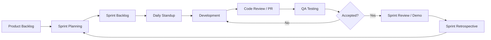

# 🏃 Scrum Workflow — Smart Tourist Guide Morocco

## Framework

The team follows **Scrum** with **2-week sprints**, using a Kanban-style board (Jira / Trello / GitHub Projects) with the following columns:

```
Backlog → To Do → In Progress → In Review → QA → Done
```

---

## Scrum Workflow Diagram



---

## Roles

| Role | Responsibility |
|---|---|
| **Product Owner** | Owns and prioritizes the backlog, defines acceptance criteria |
| **Scrum Master** | Facilitates ceremonies, removes blockers |
| **Backend Team** | Laravel API, database, business logic |
| **Frontend Team** | React SPA, UI/UX implementation |
| **QA** | Manual/automated testing, bug triage |

---

## Ceremonies

| Ceremony | Frequency | Duration | Purpose |
|---|---|---|---|
| Sprint Planning | Every 2 weeks | 2h | Select and estimate backlog items for the sprint |
| Daily Standup | Daily | 15 min | Sync on progress/blockers |
| Backlog Refinement | Weekly | 1h | Groom and estimate upcoming stories |
| Sprint Review | End of sprint | 1h | Demo completed work to stakeholders |
| Sprint Retrospective | End of sprint | 45 min | Reflect on process improvements |

---

## Definition of Ready (DoR)

A backlog item is ready for sprint planning when it has:
- [ ] Clear user story format: *As a [role], I want [feature], so that [benefit]*
- [ ] Acceptance criteria defined
- [ ] Design/mockup attached (if UI-facing)
- [ ] Estimated story points
- [ ] No blocking dependencies

## Definition of Done (DoD)

A story is Done when:
- [ ] Code merged to `develop` via reviewed PR
- [ ] Unit/feature tests written and passing
- [ ] No linting errors
- [ ] API documented in `docs/api.md` (if applicable)
- [ ] QA-verified on staging
- [ ] No known critical bugs

---

## Estimation

Story points use the **Fibonacci scale**: `1, 2, 3, 5, 8, 13, 21`.

| Points | Meaning |
|---|---|
| 1 | Trivial change, < 2 hours |
| 2–3 | Small, well-understood task |
| 5 | Moderate complexity, some unknowns |
| 8 | Large, multiple sub-tasks |
| 13+ | Should be split into smaller stories |

---

## Sample Sprint Board

| Backlog | To Do | In Progress | In Review | QA | Done |
|---|---|---|---|---|---|
| AI itinerary v2 | Driver verification flow | Hotel booking API | Room availability endpoint | Favorites UI | Auth (login/register) |
| Multi-language support | Review moderation | Attraction search filters | | | City CRUD |

---

## Backlog Prioritization

Prioritization uses **MoSCoW**:
- **Must have**: Auth, bookings (hotel & transport), core CRUD for catalog entities
- **Should have**: Reviews, favorites, AI itinerary generation
- **Could have**: Multilingual chat assistant, loyalty points
- **Won't have (this release)**: Native mobile apps, payment gateway integrations beyond MVP